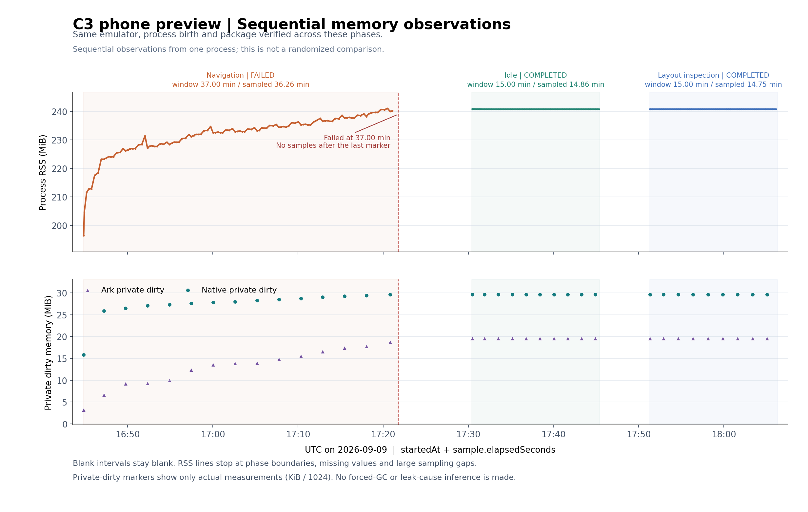

# 0.14.0：表单数据保护与模拟器持续观察

**本轮改进已定稿，验证结果按实际完成范围记录。** 当前开发版本为 **0.14.0/code35**。最终源码对应的 ARM64 完整核心调试签名包及 C4 x86_64 预览包已核验；C4 的增强表单流程、500 节点对照/夹具恢复、平板 20 分钟观察和离线回归均有独立记录。C3 inspection 对照已完成；最后的 C4 手机 60 分钟观察本轮未完成，只保留约 20 分钟的部分样本。这里的 PC 指 **2in1 模拟器**，不是实体鸿蒙电脑。

本轮由用户授权在 **2026-09-09 15:30:55Z 至 23:30:55Z** 的有界窗口内分析、改进和验证。该窗口是执行上限，不代表连续运行满 8 小时；跨日等待也不计为持续验证。执行登记显示本轮未使用额度重置。真实设备安装与 VPN 联网继续暂停；x86_64 `-ui-preview` 不含 Xray/Hev 转发核心。阶段十三的历史结果见[上一阶段记录](phase13-product-refinement.md)，不能替代本轮或真实设备的网络验收。

## 最终源码对应的构建

本轮未修改原生转发核心。两份独立核验记录均标记 `finalForCurrentSource=true`，确认签名、源码与构建副本的一致性，以及 ARM64/预览变体隔离；它们不是实体设备安装或联网记录。

| 产物 | 体积 | SHA256 | 本地核验记录 |
| --- | ---: | --- | --- |
| ARM64 完整核心，`0.14.0/code35` | 40,975,632 字节 | `918a97b082cf748d59c625c5e3759774861c2ab12f87a71c07b84691510689b5` | `build/phase14-arm64-verification.json` |
| C4 x86_64 预览，`0.14.0-ui-preview/code35` | 3,135,570 字节 | `b18ed3e3f91e57dbb9161a19547ebd2022b06f9e581b445c34ce14b6a3979fcd` | `build/phase14-preview-verification.json` |

两包均为 **debug 调试签名构建**，最低系统为 `6.1.1(24)`，compile/target 为 `26.0.0`，包内 min API24/target26。ARM64 核验包含七个原生库及其现有输入链；C4 仅包含 x86_64 预览桥接和运行库，`VPN_CORE_AVAILABLE=false`。这不构成生产 Release 或商店审核通过记录。

## 用户可见的变化

- **分流与 DNS**：识别未保存修改，返回前确认继续编辑或放弃；没有变化时不重复保存。长表单的结果提示与保存按钮固定在底部。保存时重新检查连接限制；读回异常与写入失败分别提示，输入保留。实际 GUI 检查发现 360 vp、2 倍字号下并排的模式按钮横向溢出，现使用可换行 Flex；C4 的 PC 窄窗口和平板大字号截图已确认按需换行。
- **节点导入**：未保存的分享内容、部分导入预览和服务器地址修改均有返回确认。重复保存或重复确认不会覆盖已生成的成功回执。明确请求返回时使未完成的扫码结果失效，避免迟到模块加载在确认框上启动扫码；正常系统扫码接管页面可见性仍可返回结果。
- **订阅**：未完成输入、获取或预览均有返回确认。隐藏或取消后忽略旧获取结果，迟到回调不改变新一轮状态；确认期间业务操作锁定。保存前核对来源是否改变，失败保留草稿与预览。提交成功但列表读回失败时不再显示旧节点数量或误报普通保存失败。
- **错误反馈**：这三页仅展示已知固定校验消息或安全的兜底提示，避免把意外底层异常、配置内容或本机路径直接显示给用户。对话框迟到、重复返回和诊断日志失败分别处理，不把日志异常变成保存失败。

订阅“取消”目前表示不再采用该次结果；底层请求没有向页面暴露主动取消句柄，仍由既有总计 12 秒时限负责结束与清理。

## 编辑与备份兼容修复

编辑模型接受现有核心允许的 ALPN 字符串和数组表示；字段未改动时保留原表示。WebSocket Host 能读取旧的、不区分大小写的 `headers.Host`；用户明确修改或清空 Host 时同步移除旧 Host 头，保留其他头，避免旧值重新生效。

PC 模拟器的真实 GUI 操作发现一个离线方法测试没有暴露的问题：参数化 `@Builder` 捕获旧标量值，叠加确认框打开时切换输入控件 `enabled`，会让取消返回后的输入回退。现改为在 Builder 内按字段 ID 读取最新草稿，并通过替换可观察草稿对象更新字段；原生模态期间仍由业务方法阻止修改，避免为确认框反复切换输入控件的 `enabled`。

节点备份页不再仅因 `onPageHide` 就取消文件任务，因为进入系统文件选择器或普通后台切换也可能触发该回调。明确返回和页面销毁仍使任务失效，恢复仍需预览、连接状态检查和节点库版本校验。**这项生命周期修复的离线覆盖不等于本轮系统文件保存/恢复已通过。**

## C4 表单与界面验收

下列最终成功记录均使用 **`2026-09-09-safety-v3`** 脚本，绑定上表的 C4 SHA（`b18ed3…79fcd`）。通过原生键盘事件完成输入、非法输入反馈、显式返回确认、取消后保留草稿、系统返回确认及明确放弃返回；订阅多一步名称/密码样式 URL 输入。步骤数不是独立设备数，也不是有效配置保存次数。

| 表单 | 已通过步骤 | 本地记录（相对 `build/phase14-ui-actions/`） |
| --- | ---: | --- |
| 节点编辑 | 6/6 | `final-c4-v3-editor/result.json` |
| 分流与 DNS | 6/6 | `final-c4-v3-network/result.json` |
| 节点导入 | 6/6 | `final-c4-v3-import/result.json` |
| 订阅 | 7/7 | `final-c4-v3-subscription/result.json` |

最终 C4 为 **25 个步骤**，不与历史重复运行累加。脚本先核对完整合成节点库及默认网络设置，每阶段复查候选身份，要求精确的非法消息，并设置停止/截止及临时 AX/图片清理。v3 另允许 Tab 过渡中目标暂时不可见，但重复、禁用、最终不可达或焦点移动时草稿改变仍拒绝输入；对应纯模拟安全测试为 **46/46**。

历史 C3（SHA `67fd71454d91aee1056ad57149dd8b2aa09bdecbd311bd1b305a6025de06b716`）也曾完成旧脚本的 25 步，记录继续保留为 `editor-1788972443070`、`network-1788972567148`、`import-1788972593782`、`subscription-1788972886955`。更早的 `subscription-1788972622226` 失败是密码样式 URL 掩码的测试误断言，不计通过。

safe2 的最终包尝试也保留失败：一次预览尚未启动导致读取失败；`final-c4-editor-retry/result.json` 则在输入前以 `FIELD_UNAVAILABLE` 结束。v3 区分传输失败与非合成数据，并处理有界焦点过渡。这些失败不等于节点库发生变化，也没有追溯改写为 v3 成功；旧 39 项安全测试由当前 46 项版本替代，不叠加。

桌面表单使用 `enableKeyboardOnFocus(false)` 避免非点击焦点触发软键盘，配合原生键盘事件完成上述操作；测试没有同意第三方输入法协议。

系统文件选择器能够打开，但其自身的自动聚焦仍触发第三方输入法协议，因此**本轮未成功完成文件保存、打开备份并恢复的端到端流程**。测试只关闭了本次流程触发的文件管理器及输入法进程，没有将关闭弹窗计作保存或恢复成功。上表也不包含有效节点/订阅提交或 VPN 联网。

C4 已完成 PC 窄窗口、普通/2 倍字号手机和平板的界面检查，包括分流按钮换行。最终画廊按 C4 SHA 严格筛选为 **27 张（手机 7、平板 8、PC 12）**，来源见本地 `build/phase14-emulators/final-verification.json`；手机 2 倍字号已人工检查。以下三张公开截图均由最终 C4 取得，仅使用合成节点：

| PC 窄窗口 · 2 倍字号 | 平板 · 2 倍字号 | 平板首页 |
| --- | --- | --- |
|  |  |  |

这些静态界面记录与上表的表单流程分别计数，不能替代文件选择器或联网验收。

## 500 节点合成列表对照

节点页将排序和历史匹配中的重复查找改为按 ID 建立 Map；完整 outbound 未变时复用配置指纹，相同 ID 的配置变化会使缓存失效。相同指纹请求合并，失败允许重试；首次 `aboutToAppear` 与紧接的 `onPageShow` 不再重复读取节点库和启动历史匹配。

同一 PC 模拟器上的 500 个节点及耗时历史均为明确生成的合成数据。每轮包含六次排序状态切换；下表仅列三次**切换为按耗时排序**的动作：

| 运行 | 三次耗时（ms） | 对应 UI CPU ticks |
| --- | --- | --- |
| 0.13.0 基线 | 2000.09 / 2043.50 / 2051.15 | 99 / 92 / 91 |
| 0.14.0 候选 C2 | 1115.71 / 1106.06 / 1127.77 | 17 / 18 / 23 |
| 0.14.0 最终 C4 | 1247.77 / 1178.12 / 1166.78 | 21 / 20 / 21 |

记录分别为 `build/phase14-list-benchmark/` 下的 `baseline-013-list500/result.json`、`optimized-014-list500/result.json` 和 `final-c4-list500/result.json`。三轮应用窗口均为 **2090 × 1394 px**，仅位置不同；最终 C4 六次排序状态切换都检查到正确的预期首行。

这些耗时包含 HDC 命令及 UI Inspector 检查开销，表示从操作到检查到预期首行的时间；CPU 单位是系统时钟 ticks。该小样本说明这一合成列表操作在本次环境中用时及 CPU 增量下降，不能推出普遍帧率、网络速度或所有设备上的改善幅度。

0.13/C2 两份对照由旧脚本进程产生，记录版本但没有 `artifactSHA256`；C2 归属来自当时的安装与运行顺序。最终 C4 对照记录包含完整 C4 SHA，三者保持独立，新脚本的包身份绑定不追溯适用于旧记录。

C4 对照后已通过夹具脚本恢复原来的 **2 条合成节点与空历史**，节点库 SHA 与事先备份一致（`f5abc9b368eab6fbdec7511daf2b4b6779b24e3723536738d1d228736389e6be`），记录在 `build/phase14-fixtures/15558/restored.json`。旧夹具资料保留在 `baseline-15558-restored/`。这是调试沙箱中的合成夹具恢复，**不是应用 FilePicker 备份/恢复流程通过**。

## 有界观察与测试脚本

25 分钟的 0.13 手机模拟器导航基线已结束：75 个样本、74 次动作，实际采样跨度 **1410.41 秒**，进程总运行窗口约 1500 秒；RSS 从 **200.16 MiB** 到 **225.46 MiB**，预热后线性斜率约 **27.46 MiB/小时**。随后同一已热身应用的 15 分钟空闲对照已完成：75 样本、0 动作、实际跨度 **890.72 秒**，RSS **225.6445 → 225.6289 MiB**，暖段斜率为 0。

**C3 手机的计划 60 分钟导航观察实际失败，不能记为完成。** 摘要以 `UI_OR_HDC_OPERATION_FAILED` 结束，总运行 **2220.28 秒**、实际采样跨度 **2175.58 秒**，保留 114 个样本/113 次动作。已记录样本属于同一进程，RSS 为 **196.445 → 240.121 MiB**，预热后斜率约 **24.47 MiB/小时**。最后成功的 Nodes 样本在 **17:21:05.570Z**，失败报告在 **17:21:46.620Z**，相隔 41.05 秒；失败报告时间与平板宿主启动时间接近，不能据此判定 HDC 干扰、宿主故障或应用崩溃。

C3 部分记录在相同页面、预热后 **453.48 → 2162.40 秒**的比较中，RSS 增加 13,200 KiB，PSS 增加 12,397 KiB，private dirty 增加 12,388 KiB；Ark PSS 约占 PSS 增量的 78%，native 约占 21%，`.so` RSS 仅增加 64 KiB，字体项未变。与 0.13 匹配相同时间窗口后斜率相近，**不能把本轮列表响应改善表述为内存优化，也不能从此单次窗口认定泄漏或无泄漏。**

C3 随后的 **15 分钟空闲对照已完成**，与失败导航保持同一进程及启动代次：75 样本、0 动作、实际跨度 **891.84 秒**，RSS **240.8008 → 240.7383 MiB**，暖段 RSS 斜率为 0。10 次 Ark PSS/private dirty 采样完全相同，native PSS/private dirty 初期各减少 4 KiB 后平坦，暖段总 PSS 仅有 1 KiB 摆动，字体与 `.so` 项不变。本轮观察是导航时增长、15 分钟空闲窗口停止增长，未回到导航前水平；尚无对象级证据区分缓存、可达对象或分配器/虚拟机保留，不能称无泄漏。

**C4 平板 20 分钟导航已完成**：69 样本、61 动作、同一进程，实际跨度 **1186.62 秒**，RSS **228.8477 → 237.1914 MiB**，暖段斜率约 **26.6234 MiB/小时**。相同页面暖段 431.80–1019.05 秒的 PSS 增加 4,225 KiB，其中 Ark 增加 3,202 KiB、native 增加 999 KiB，`.so`/字体项不变。它是平板 UI 观察，不替代手机 60 分钟窗口。

C3 同进程的 **15 分钟 inspection 对照已完成**（17:51:17Z 起）：70 样本、62 次 Inspect、导航动作 0、实际跨度 **884.81 秒**，RSS **240.7383 → 240.7422 MiB**（仅增加 4 KiB），暖段斜率为 0，CPU 增量 56 ticks。9 次 Ark/native PSS 与 private dirty 都未变，字体和 `.so` RSS 不变，暖段总 PSS 为 97,729–97,730 KiB。最后 90 秒纯指标尾部的 7 个 RSS 样本相同，但只有 1 次分项样本，不单独估计分项趋势。

这组顺序对照中，导航段私有内存增长，随后同进程的 idle 与重复读取 Home 布局的两个 15 分钟窗口平坦。不过导航、idle、inspection 的采样间隔中位数分别约 **17.62 / 12.20 / 13.07 秒**，页面/渲染工作与初始堆状态不同；不能据此把增长唯一归因于导航，或证明泄漏、无泄漏、内存优化。相关阶段与限定结论保存在 `build/phase14-memory-analysis.json`。

图中仅包含 C3：导航总窗口约 37 分钟、实际采样 36.26 分钟并以失败结束，随后两段 15 分钟控制完成。空白时间不连线，下图只标实际取得的 private dirty 样本。观察顺序和节奏不同，不能用这张图判定因果或排除泄漏。绘图源码见 [plot-emulator-memory.py](../scripts/plot-emulator-memory.py)，使用 Python、Matplotlib 和 NumPy；重画需要本地对应样本，不包含 C4 的独立观察记录。

**最终 C4 手机的计划 60 分钟导航观察本轮未完成。** `build/phase14-soak/final-c4-phone-navigation/samples.jsonl` 留下 **65 个样本**，首末 `elapsedSeconds` 为 **3.73 → 1222.38 秒**，实际采样跨度 **1218.65 秒（20.31 分钟）**。全部样本绑定 C4 SHA（`b18ed3…79fcd`），进程号与启动标记始终一致（原始值保留在本地记录中）；这段记录的 RSS 为 **196.9844 → 235.0352 MiB**。

该目录没有 `summary.json`，无法核验完整完成状态、结束时间或具体中断原因。本地 `interruption-review.json` 仅整理已有部分样本，不能替代执行摘要或补足缺失的 60 分钟窗口。C4 部分记录与 C3 失败及两段控制观察独立保留，不合并成一次完整长时测试，也不据此判断无泄漏。

本轮补强了三个辅助脚本：

- `soak-emulator-ui.cjs` 支持 `navigation`、`idle`、`inspection` 三种 activity。idle 只在起点回到首页，之后只观察进程；inspection 在初始 Home 后仅运行 Inspect，不切页，最后 90 秒只采进程指标，`uiInspections` 与导航 `actions` 分开计数。它用来区分检查界面与纯空闲的影响，不能混称同一种空闲。摘要区分采样跨度和总时长，硬截止截短、停止或观察不足不记为完整完成。
- `benchmark-emulator-list.cjs` 固定候选 SHA、版本与 code，设置 180 秒总上限和 `STOP` 标记，拒绝覆写已有证据；临时 AX 数据清理及异常输出有固定边界。
- `test-emulator-fixtures.cjs` 只接受已知合成节点和空历史，写入前记录传输状态；中断后只恢复与备份、目标字节或已记录传输前缀匹配的数据。旧 manifest 需逐项核对字节 SHA 后升级，未知节点或新历史不会自动覆盖。

脚本均先检查显式 loopback 目标及 guest 模型/名称为 emulator，再核对 x86_64 预览包。新运行绑定的证据不与旧进程记录混用。停止标记在命令边界检查，正在执行的辅助导航命令最多可能到其 90 秒时限才返回，不承诺即时停止。

## 冻结候选的离线回归

`build/phase14-offline/c4-20260909T172657Z/summary.json` 记录 **23/23 套件通过、0 套件失败**，112 份源文件在运行前后 SHA 一致。各套件报告独立归档，没有覆盖现场或旧构建报告。增强表单 workflow 及其安全测试当时尚在修订，明确排除在这份 112 文件清单之外；其后当前 v3 单独完成的 **46/46** 安全检查保留独立归属。

| 本轮相关套件 | 结果 |
| --- | ---: |
| 节点管理与性能 | 142 项通过 |
| 节点编辑/备份模型及编辑页 | 44 项通过 |
| 文件备份页与文件适配器 | 16 项通过 |
| 网络设置表单 / 网络策略 | 28 / 28 项通过 |
| 订阅表单 / 订阅获取 | 36 / 16 项通过 |
| 节点库 | 54 项通过 |
| 自适应模型 / 次级页面 | 21 / 11 项通过 |
| 当次 soak / fixture / benchmark 安全 | 30 / 25 / 36 项通过 |

表中是 23 套件中的相关项目，其他套件、脚本 SHA、计数单位及完整输出路径以汇总 JSON 为准。测试使用合成 SDK、文件、命令或虚拟时钟，不构成真实 GUI、文件选择器、原生堆回收或网络证明；部分套件按分组计数，不能相加成一个整库断言总数。

后续脚本新增 inspection 与安全诊断后，当前 `test-emulator-soak-safety.cjs` 为 **45/45**、`test-adaptive-diagnostics-safety.cjs` 为 **15/15**；它们替代各自旧脚本版本的计数，不与旧 30/37 项累计，也不追溯改写前述 23 套件汇总。应用源码和两份构建产物未因脚本改动而改变。

## 本轮未完成项与保留边界

- C4 手机 60 分钟导航本轮未完成，仅有上述 20.31 分钟部分样本，具体中断原因未确认；已完成的 idle、inspection、平板观察及 C3 失败记录保持独立。
- C4 的 27 张最终截图与 23 套件离线回归已经确认，后续若改变脚本或源码需分别记录。
- 真实平板/PC 安装、授权、DNS/HTTPS、连接恢复及核心资源清理未在本轮验收。x86_64 预览、非法输入/丢弃流程和合成列表观察均不能替代它们。

本文不作应用商店通过、生产 Release、无泄漏或核心联网稳定性的承诺。本地 `build/` 证据不随源码自动发布。
