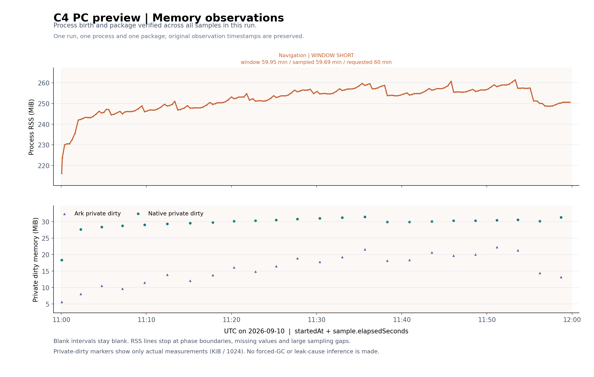

# 阶段十五：模拟器内存观察与采集可靠性

2026-09-10。本阶段取得四份有效 ArkTS 堆快照，补强模拟器长测的中断记录，并将堆诊断与正常预览包长测分开。五轮重复导航没有观察到本次候选页面及订阅对象实例递增；静置后的较大数组收缩解释了部分此前增长。现有证据不足以宣称所有内存问题已经排除。

## 范围与产物身份

本轮使用 PC 模拟器、两个合成节点和未连接的 UI 场景；没有真机、VPN 流量或真实节点凭据验证。`native_size` 是快照字段，不能等同于操作系统的 Native 堆统计，也不能用于证明未加载的 VPN 核心没有泄漏。

| 用途 | 构建 | HAP SHA256 |
|---|---|---|
| 正常 UI 长测 | C4，0.14.0/code35 UI preview | `b18ed3e3f91e57dbb9161a19547ebd2022b06f9e581b445c34ce14b6a3979fcd` |
| 四快照对象诊断 | 独立 heap-probe2 UI preview | `fb9a3ae9cde8dc1587ed2aa02208e5d10f111d359563703b57ce4824b7b3b52f` |

四次对象诊断均核验为同一应用进程、同一进程出生计数和同一诊断 HAP。公开文档不记录进程标识、设备地址、用户名路径、堆字符串或业务属性值；原始快照及详细回执留在本地忽略的构建证据目录。

## 长测采集器改进

`scripts/soak-emulator-ui.cjs` 增加独立运行标识、脚本哈希和启动清单。每条样本写入并同步后，才通过同目录临时文件、同步、重命名发布 checkpoint。checkpoint 始终标记为最近一次已观察状态，`completionClaim` 为 false，不携带完成结论；只有终结流程发布最终 summary。

正常结束、停止文件、SIGINT、SIGTERM、硬截止以及持久化失败均保留明确结果。最后一次等待边界收到停止信号时，不再误报完成；输出失败记为失败而不自动重试。phase14 与 phase15 的采集输出、安装记录和 UI helper 调用互相隔离。

采集器的最终离线验证为 **84 项通过、0 项失败**；配套 helper 诊断为 **18 项通过、0 项失败**，语法及差异检查通过。此前 59、76 项是中间版本结果，不重复累计。覆盖真实临时文件的原子替换、部分写入和同步/重命名失败、旧 checkpoint 保留、summary 写入失败，以及合成子进程被强制终止后仍保留可解析清单与 checkpoint、没有完成 summary。末尾不足 4 秒时改为可中断等待到计划终点；同一合成条件下，旧代码在 57.50 秒提前结束，修复后到 60.00 秒，并通过独立检查器。设备通信和 UI 均为模拟依赖，**离线测试通过不代表设备已完成 60 分钟观察**。

只读检查器 `scripts/inspect-emulator-soak.cjs` 核对运行身份、字节前缀、样本顺序、观测时长及终结结果。出现新版 collector 和耗时字段时，还会校验策略、哈希、各条耗时与汇总的一致性；失败 helper 的耗时单列，不计入已记录成功样本。缺少 summary 时只返回“完成状态未确认”，不会推断进程仍在运行。旧格式保留原兼容范围，不补造新字段。该检查器的 **62 项临时文件测试**通过，计数替代此前 27 项。

```powershell
node scripts/inspect-emulator-soak.cjs --run-dir build/phase15-soak/<本次运行目录>
```

这些检查验证记录内部的一致性，不是对来源的密码学认证。原始堆快照加入忽略规则，不随源码发布。

如需重复普通预览包的观察，先完成签名 UI 预览包安装并确认界面就绪；为每轮使用新的标签。下面的端口只是本项目 PC 模拟器示例，应替换为实际目标，不能使用诊断变体来代替普通包结果。

```powershell
$label = 'pc-navigation-' + [DateTime]::UtcNow.ToString('yyyyMMdd-HHmmss')
$deadline = [DateTime]::UtcNow.AddHours(2).ToString('o')
node scripts/soak-emulator-ui.cjs --target 127.0.0.1:15558 --phase phase15 --minutes 60 --label $label --deadline $deadline --activity navigation --memory-breakdown-every 8
node scripts/inspect-emulator-soak.cjs --run-dir "build/phase15-soak/$label"
```

需要提前停止时，在该运行目录创建 `stop.request` 文件。停止、失败、没有最终摘要和完整完成是不同结果；不要合并几轮短记录来补足指定时长。

## 宿主与模拟器启动中断

前一日手机和 PC 模拟器的宿主进程在同一毫秒以相同退出码 `1073807364`（`0x40010004`）结束，随后出现心跳丢失；宿主系统之后也有关闭与启动事件。Microsoft 将该数值命名为 `DBG_TERMINATE_PROCESS`，但进程退出值也可以由调用者指定，仅凭数值不能确定终止发起者或根因，更不能归因于应用内存泄漏。[Microsoft NTSTATUS](https://learn.microsoft.com/en-us/openspecs/windows_protocols/ms-erref/596a1078-e883-4972-9bbc-49e60bebca55)、[退出状态来源](https://learn.microsoft.com/en-us/windows/win32/api/processthreadsapi/nf-processthreadsapi-getexitcodeprocess)

本次旧手机模拟器冷启等待期间未达到 guest 启动完成状态，内核与 QEMU 日志也未产生本轮更新；停止后单独启动 PC 模拟器，PC 正常报告启动完成并写入新日志。这个对照不能确定手机失败原因，也不支持把问题归为整个宿主虚拟化不可用。启动过程中的 `OnSystemReset` 日志在成功 PC 启动中同样存在，不等于执行了用户数据重置。本轮没有重置模拟器数据、删除旧镜像或修改宿主虚拟化/电源设置。

## 堆采集方法与 GC 边界

先尝试官方 HiDumper 的线程级与进程级 raw 快照命令。两次命令退出为 0，但没有取得文件，均按采集未完成处理。异步调度返回成功不保证后续导出落盘。[官方 HiDumper 文档](https://developer.huawei.com/consumer/cn/doc/doccenter-capabilities/hidumper)

独立诊断变体随后尝试 `dumpJsRawHeapData(true, false)`，调用失败。诊断能力标记显示 raw 和 legacy 两个函数都存在，故不能把这次失败表述为“API 不存在”或“模拟器统一不支持”；此前异常信息不足以确认 raw 失败根因。

显式选择 legacy `dumpJsHeapData` 后，取得四份非空、可解析的标准 heapsnapshot。每份都验证实际文件大小、SHA256、节点数组、边数组、目标偏移、计数及回执；没有把发起调用或命令退出码当成成功证据。整个诊断过程保持 `needClean=false`，避免在对比期间主动清除 nodeId 缓存。

legacy 接口没有供调用者选择 GC 的参数，因此回执保留 `gcMode: platform-default`。已查上游源码：legacy 创建默认 `DumpSnapShotOption`，其 `isFullGC` 默认 true；底层据此执行 FullGC/SharedGC，再导出堆。但尚未将上游实现与当前模拟器 SDK 双参二进制逐项对应，也没有用当前回执独立证明设备上的 GC 次数。应将其理解为上游预期的 GC 后快照，不能声称它只包含页面业务对象或完全没有未回收内容。[legacy 实现](https://gitee.com/openharmony/developtools_profiler/blob/master/hidebug/interfaces/js/kits/napi/napi_hidebug_dump.cpp)、[默认选项](https://gitee.com/openharmony/arkcompiler_ets_runtime/blob/master/ecmascript/dfx/hprof/heap_profiler_interface.h)、[GC 与导出实现](https://gitee.com/openharmony/arkcompiler_ets_runtime/blob/master/ecmascript/dfx/hprof/heap_profiler.cpp)

## 四快照顺序与数值

请求序号严格为 1、2、3、4。分析器检查每份采集的“开始 ≤ API 请求 ≤ API 结束 ≤ 采集结束”，并要求前一份采集结束早于下一份开始，拒绝倒序、重复序号和区间重叠。四次 API 调用耗时分别为 **1136、1094、1184、888 毫秒**；它们属于诊断开销。

1. A：Home 基线。
2. B：首次导航暖机后返回 Home。
3. C：再完成 5 轮、40 个成功导航动作后返回 Home；包括节点、设置、网络设置、关于、隐私和编辑页。
4. D：随后持续静置后的快照。中间有一段完整的独立 5 分钟 idle 采样，**采样结束到 D 的 API 调用又经过约 149.1 秒静置**，不能称 D 是“紧接 5 分钟”取得。

| 指标 | A 基线 | B 暖机 | C 再五轮 | D 静置后 |
|---|---:|---:|---:|---:|
| 文件大小 / B | 20,913,601 | 22,377,775 | 22,464,037 | 21,709,607 |
| 总节点数 | 148,919 | 150,788 | 151,412 | 151,403 |
| 总边数 | 1,054,534 | 1,123,011 | 1,128,136 | 1,070,342 |
| 非 string 节点数 | 125,394 | 126,861 | 127,433 | 127,446 |
| 非 string 自身大小 / B | 9,442,340 | 10,011,396 | 10,060,388 | 9,599,076 |
| 非 string native_size / B | 590,397 | 590,397 | 590,397 | 590,397 |
| string 类节点数 | 23,525 | 23,927 | 23,979 | 23,957 |
| strings 表条目数 | 66,163 | 111,870 | 112,055 | 112,069 |

strings 表含节点名、属性名等字典条目，其条目数不能直接当作存活字符串对象数量；快照文件大小也不等同于进程内存。

| 相邻差分 | A→B | B→C | C→D |
|---|---:|---:|---:|
| 非 string 自身大小 / B | +569,056 | +48,992 | −461,312 |
| array 自身大小 / B | +515,944 | +35,104 | −462,432 |
| object 自身大小 / B | +15,056 | 0 | 0 |
| closure 自身大小 / B | +13,272 | 0 | 0 |
| framework 自身大小 / B | −34,056 | 0 | 0 |
| native_size / B | 0 | 0 | 0 |

B→C 最大新增与最大移除的数组都是 **458,840 B**，匿名父路径一致，不能把新增分配总量当作净增长。C→D 中，同一保留 nodeId 的该数组从 **458,840 B** 缩到 **1,880 B**，减少 **456,960 B**；它解释了这次静置下降的大部分。A→D 的非 string 自身大小仍净增 **156,736 B**，因此结论不是“所有增长都已经回收”。

## 对象生命周期核对

堆中的名称不是纯类名。分析器仅识别固定候选名称标记，并通过 `对象 → __proto__ → constructor` 关系区分实例、prototype 和函数；派生类 prototype 不当作基类实例。命名标记可能存在模块间重名，尚未将全部编译名称恢复为唯一源码类。

| 有结构证据的候选实例 | A | B | C | D |
|---|---:|---:|---:|---:|
| Home | 1 | 1 | 1 | 1 |
| ObservedPropertySimplePU | 77 | 77 | 77 | 77 |
| ObservedPropertyObjectPU | 61 | 61 | 61 | 61 |
| SubscriberManager | 1 | 1 | 1 | 1 |
| NodeEditor | 0 | 0 | 0 | 0 |

Home 名称命中的两个 object 是一个实例和一个 prototype。NodeEditor 暖机后出现名称相关函数及两个 prototype，此后数量不再增加；不能把它们当作两个未销毁页面。Nodes、Settings、NetworkSettings、About、Privacy 未取得候选实例命中，这不证明它们在所有编码方式下都不存在，也不能替代完整对象归属分析。

本次检索范围内，五轮重复操作没有使候选页面及订阅实例递增。完整报告还保留了仅含数值的新增、移除、扩容、收缩数组路径。路径只排除显式 weak 边，没有建模所有 VM 特殊根与 ephemeron 语义，因此它们是引用路径线索，不是最终泄漏根因。

## 独立 idle 与正常长测状态

诊断进程的 idle 采样请求为 **300 秒**，最终 summary 完整，**25 个样本**首尾跨度 **283.28 秒**，期间 **0 个导航动作、0 次 UI Inspect**。RSS 从 **282.9961 MiB** 到 **282.9766 MiB**，净变 **−0.0195 MiB**，进程身份保持一致。这是已经经历堆采集的诊断进程结果，不能混入正常预览包的纯长测，也不能把之后 D 快照的变化全部归于这段被采样的 300 秒。

普通 C4 PC 长测各轮独立保留：

| 运行记录 | 状态 | 已核验范围 |
|---|---|---|
| `ordinary-c4-pc-navigation` | failed | 启动阶段 Home 布局读取超时，0 个样本。 |
| `ordinary-c4-pc-navigation-ready` | failed | 38 个样本、37 次动作，实际跨度 707.56 秒；Privacy 流程的布局读取达到原 12 秒上限。 |
| `ordinary-c4-pc-layout30` | stopped | 用户要求暂停；6 个样本、5 次动作，实际跨度 77.05 秒，未完成 60 分钟。 |
| `resumed-c4-pc-layout30` | 时长不足，检查器拒绝完成结论 | 运行 3597.29 秒、采样跨度 3581.51 秒；190 个样本、183 次动作，同一进程。旧采集器误写 completed，原记录保留。 |
| `boundary-fixed-idle60` | insufficient-observation | 修复后运行 60.01 秒；5 个样本、实际跨度 38.00 秒，同一进程。检查器确认有序终结，但不确认完整观察。 |
| `boundary-fixed-idle120` | completed，检查器确认 | 修复后运行 120.00 秒；10 个样本、实际跨度 100.30 秒，同一普通 C4 进程。仅为 2 分钟 idle 回归。 |

前两轮失败均保存了最终失败位置；不能据此认定应用崩溃。针对偶发读取耗时，仅 `dumpLayout` 的外部等待上限从 12 秒调整为 30 秒，其他 HDC 命令保持 12 秒，helper 总预算保持 90 秒。没有自动重试；新增数字耗时统计，并把失败 helper 统计与已记录成功样本的统计分开。扩大采集等待上限不等于改善了应用帧率。

`resumed-c4-pc-layout30` 于 **10:59:59.286Z 开始，11:59:56.576Z 结束**。原采集器在余时不足 4 秒时直接退出，导致比请求的 60 分钟少 **2.71 秒**。只读检查器返回 `COMPLETION_EVIDENCE_INSUFFICIENT`；没有修改历史数据或放宽通过标准。该记录是 **59 分 57.29 秒的实际观察**，不是完整 60 分钟通过。修复后的 1 分钟实际回归已确认末尾等足时长，但启动检查和采样间隔使样本跨度少于要求的 40 秒，故仍正确报告观察不足。

这份接近一小时的普通 C4 记录包含 **964 次布局读取**，最长 **3025 毫秒**，超过 10 秒的读取为 **0**；24 次内存分项采样全部取得数值。RSS 从 **216.1992 MiB** 到 **250.5859 MiB**，暖机 5 分钟后的线性拟合斜率为 **+9.7131 MiB/小时**，过程中也有回落。正常观察没有主动请求 GC，不能仅凭回落确定回收机制；起止差和单轮拟合也不能证明已经达到稳定平台，或将增长归因于应用泄漏。



图中的原始时间戳、缺测区间和实际分项采样点均保留。绘图工具独立标记 `WINDOW SHORT`，数值回执保留原采集器 outcome 及 `requestedDurationMet: false`，不会将历史误报变成完成结论；5 项合成测试覆盖时长不足、精确边界、采样不足、失败和停止。可在已有 Matplotlib/NumPy 环境中复现：

```powershell
python scripts/plot-emulator-memory.py --phase phase15 --device pc --cohort C4 --runs resumed-c4-pc-layout30 --output c4-phase15-pc-memory.png
```

旧失败、暂停、堆快照、诊断 idle 与短时修复回归均不拼成一次完整的 60 分钟测试。

最终短时回归 `boundary-fixed-idle120` 在 **12:09:14.846Z—12:11:14.847Z** 完成，运行时长 **120.00 秒**，有效采样跨度 **100.30 秒**，检查器确认 `completed`。10 次内存分项采样全部成功，RSS 为 **249.2891→249.2930 MiB**。它验证了修复后普通模拟器包的计时和记录终结路径，不替代一小时或 VPN 联网验证。

## 分析器验证与结论边界

`scripts/analyze-emulator-heaps.cjs` 在真实四快照上完成校验；11 项针对性隐私、结构分类和顺序检查通过。输出身份只有数值与合法 SHA256；API、GC 模式、节点类型和边类型使用明确白名单，其他原始 metadata 不输出。发现导出器有四个共用零 ID 的 handle 记录，保留在总量中但不做跨快照 ID 匹配；`native_size` 存在，而类型描述符比节点字段少一个，此差异明确记录，没有错位读取。

本阶段六组离线检查共 **213 项通过**：采集器 84、helper 18、检查器 62、诊断模板 33、堆分析 11、图表 5；历史版本计数不重复相加。它们与实际模拟器观察分开记录。

目前已把“进程内存增长”推进到“候选实例计数稳定、部分大数组属于替换及静置收缩”的对象级证据。尚未证明全部增长来自哪个平台缓存，尚未证明不存在其他对象泄漏，也没有真机或 VPN 核心长时验证结论。本阶段没有修改普通应用或原生核心源码，版本仍为 0.14.0/code35。
