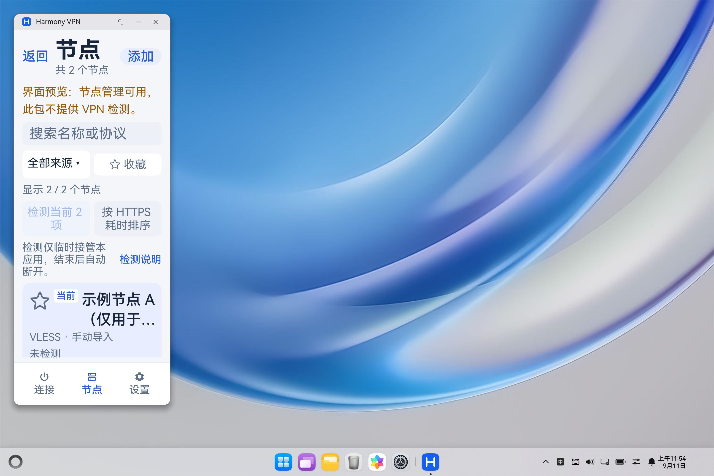
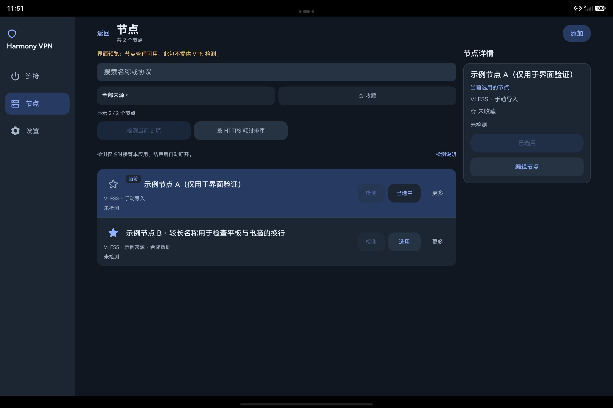

# 0.15.0：节点收藏、导入衔接与多端列表

2026-09-11。阶段十六将日常节点管理补入 **0.15.0/code36**：收藏、来源筛选、导入结果定位，以及大屏列表旁的节点详情。最终候选为 **C6**，两种构建与冻结源码离线回归已核验；三端模拟器交互、PC 窄窗口两倍字号和十分钟观察已完成相应检查，随后完成一台 API26 手机的原地升级、收藏迁移与短时 Wi-Fi 联网验收。各项结果按下文范围记录，C6 平板额外文件流程仍保留用户暂停时的未完成状态。

本阶段先使用合成节点和模拟器，再进行手机真机测试。模拟器部分的 PC 指 2in1 模拟器，平板和手机分别指对应模拟器；实际 ARM64 手机的升级及联网结果在独立段落中说明。业务改动位于 ArkTS/ArkUI，原生 C++ 转发与上游核心源码未改。

## 用户可见的变化

- **收藏与来源筛选**：节点名称旁可收藏或取消收藏；列表支持全部来源、手动导入及各订阅来源。收藏、来源、搜索和本次导入范围取交集，原有 HTTPS 耗时排序继续可用。筛选只改变显示内容，不重排节点库或改变当前选择。
- **导入后直接查看**：节点保存并读回确认后出现“查看导入的节点”。本次新增节点和已经存在的重复项都可以定位；输入修改、新扫码、保存失败或离页会使此前成功结果失效。
- **列表与详情**：点击名称查看详情，与“选用”分开。手机在列表行内展开详情；足够宽的窗口在列表旁显示详情栏，展示名称、协议与来源、收藏、当前选择和已有检测结果，并提供选用、编辑入口。
- **保存反馈**：收藏、改名、选用和删除在写入之后再刷新列表。写入已经提交但列表读回未确认时明确区分这两种状态，避免把旧界面当成已完成刷新，或把已提交操作误报为未保存。

已有当前节点在收藏、筛选、查看详情和导入后查看结果时保持选中；这些操作不会自动连接。空节点库首次导入仍按既有规则选择第一个有效节点。用户明确选择另一节点、删除当前节点或确认恢复整个备份时，当前选择可以按相应操作规则改变。

## 节点库与备份兼容

`entry/src/main/ets/model/NodeCatalog.ets` 将节点库和整库备份版本升级为 **schemaVersion 2**，每个节点增加布尔字段 `favorite`。旧 v1 数据先完整执行原字段与内容校验，再在内存中补入 `favorite=false` 并转换为 v2。正常读取和备份预览不会仅为迁移而改写磁盘，也不增加 revision；下一次实际修改通过既有临时文件、同步和原子替换流程提交 v2。

收藏修改保留节点 ID、出站配置、当前选择与配置修改时间。重复导入、改名以及按原 ID 编辑节点都会保留收藏；订阅更新仅对完整配置仍然匹配的旧节点保留原 ID 和收藏。新配置生成新节点，默认未收藏；已经移除的订阅节点不会仅因名称相同而继承旧收藏。

| 输入或操作 | 0.15 的处理 |
| --- | --- |
| 合法 v1 节点库 | 严格校验后在内存中转换，原始磁盘字节和 revision 保持不变。 |
| 合法 v2 节点库 | 校验 `favorite` 必须为布尔值，其余节点与来源约束继续生效。 |
| v1 整库备份 | 可预览及恢复，节点默认未收藏；恢复时沿用当前库的 revision 顺序。 |
| v2 整库备份 | 可预览及恢复，保留收藏、来源、节点身份和备份中的当前选择。 |
| 备份外层与内部库版本不一致 | 拒绝恢复，不尝试部分修复。 |
| 0.15 新导出的整库备份 | 统一为 v2，包含从 v1 读取后补齐的收藏字段。 |

**新导出的 v2 整库备份需要 0.15 或后续兼容版本读取，0.14 不支持此格式。** 旧 v1 备份仍可由 0.15 导入。单节点出站 JSON 不包含收藏等节点库元数据；恢复整个备份会按页面明确提示替换整库及当前选择，不能把这种显式恢复描述为保留恢复前选择。

## 路由与状态更新

`NodeListNavigation.ets` 只传递经过校验的节点 ID 数组和本次保存请求 UUID，不传分享内容、出站 JSON 或连接凭据。ID 范围为 1 至 500 个唯一合法标识；请求和数组一同校验。导入页使用单实例路由复用节点列表，节点列表按当前库求交集，缺失的 ID 不会使结果放宽为全部节点。

节点列表每次仅消费新的请求 UUID。用户点击“查看全部”后去编辑页再返回，不会重新套用旧的导入筛选；同一组节点再次成功导入获得新回执，仍可重新查看本次结果。保存是同步提交，扫码和路由的异步结果分别受页面代次、扫码代次和离页状态约束；已有未保存草稿及返回确认不会被查看结果入口绕过。

C5 增加了读取失败保护：节点列表暂不可读时不消费导入请求，也不清除已有读取错误；恢复读取后才应用该请求。相应离线用例先复现“读取失败后错误被清空且请求被提前消费”，再验证保留错误和延迟消费。收藏、改名、选用和删除同时补充“提交成功但列表读回未确认”的反馈。

## 自适应布局与真实界面修复

布局按窗口的逻辑 vp 宽度决定，不按设备名称写死。节点内容区最大为 1200 vp；内容区达到 1020 vp 时增加 300 vp 详情栏，两栏间距为 16 vp，外边距共 40 vp。列表有效宽度达到 640 vp 时行内操作横排，否则上下排并允许按钮换行。顶部与底部导航继续遵循现有手机和大屏布局规则。

C2 的平板真实界面操作发现：收藏已经写入节点库，收藏筛选数量也正确，但星标及详情仍显示旧值。原因线索与稳定 ID 的 `ForEach` 复用旧行、参数化 `@Builder` 持有旧节点对象一致；仅执行业务方法的离线检查未暴露这个渲染问题。

C3 将详情改为独立 `NodeDetailsCard` 组件，以标量 `@Prop` 接收当前名称、来源、收藏、选择、检测结果和可编辑状态。列表和行内详情通过稳定节点 ID 从当前 `@State nodes` 读取可变字段，保留列表 ID，不依靠重建整张列表刷新。平板真实操作随后确认收藏与取消收藏的星标、详情同步更新，查看另一节点没有改变当前选择。

C4 继续修复再次改名时的旧名称：打开改名操作时按 ID 从当前节点库读取名称。新的导入结果路由也会清除上一操作的反馈；C5 在此基础上补入前述读取失败保护，避免清掉本次有效错误。

C6 的业务逻辑保持 C5 实现，仅将侧栏品牌区域改为上下排列，并缩短收藏筛选按钮文案，以改善两倍字号下的空间分配。手机和平板的 C6 两倍字号界面已经实际检查，PC 也另行完成 C6 窄窗口两倍字号采集；早期 C5 结果仍独立保留，不与 C6 混用。

## 候选身份与构建验证

各候选均属于 0.15/code36，但源码和 HAP 不同，以下 SHA256 用于区分证据。较早候选的成功或失败均保留，不合并成 C6 的验收结果。

| 候选及产物 | HAP SHA256 | 本记录中的用途 |
| --- | --- | --- |
| C2 x86_64 UI 预览 | `21467f52d1546ac760f9327f9c2219a3ce018928582d115e8bed8a9790d66fce` | 早期 25 套离线检查、平板界面缺陷发现。 |
| C3 x86_64 UI 预览 | `b75cfe49a86e1ed2f6683f5d18621017407ba43e4ae50c7d019eb5a816a951fe` | 详情组件与收藏刷新修复后的平板观察。 |
| C4 x86_64 UI 预览 | `3d01efaf959e5e44b98e879f3fedf8112d9db4e4afcdd9aad3eb50936e1d44eb` | 平板系统文件选择器备份恢复闭环、早期手机和 PC 基本布局。 |
| C5 x86_64 UI 预览 | `58de5a0b7937a7480464e6277e3933a74a2b3fd3682739df477978281677df31` | 读取失败反馈修复及早期 PC 窄窗口观察。 |
| C5 ARM64 完整核心调试包 | `ae4f7c51b00e8c65f391d0a75abcf12858b7b20c6360e045a240a0632765a261` | 历史 SDK 构建及静态产物验证。 |
| C6 x86_64 UI 预览 | `5132b0316dcf6f602498476d3524ea2e30a0ca69325813c07dff1264d0f1d3c7` | 最终预览候选，本文 C6 模拟器记录均绑定此包。 |
| C6 ARM64 完整核心调试包 | `48a19672d898ecf5c4a381f36bb3f6e764ea5929d3565358027dd22f6024b3fa` | 最终 ARM64 构建与静态产物验证。 |

C6 ARM64 产物为 **41,066,706 字节**，包内版本 `0.15.0/code36`，min API24、target API26。本地记录 `build/phase16-arm64/20260911T033306Z-c6/verification.json` 中 **13/13 检查通过**，包括源码快照与构建副本一致、冻结后源码未变、归档包与构建输出相同、版本与 API 匹配、仅 ARM64、完整核心能力开启、UI preview 关闭、七个原生库及现有输入链校验、签名校验。

C6 x86_64 UI 预览产物为 **3,226,643 字节**，版本 `0.15.0-ui-preview/code36`，同为 min API24、target API26。`build/phase16-preview/c6-20260911T033619Z/verification.json` 中 **13/13 检查通过**，包括预期 C6 包身份、归档一致、构建成功、源码与构建副本及冻结版本对应、验证期间源码未变、版本及 API 匹配、预览能力隔离、仅 x86_64 预览桥接库和签名校验。

这是本地签名的 **debug 包**，不是生产 Release 或商店审核结论。ARM64 的**构建核验时**记录为 `deviceInstalled=false`、`vpnNetworkTestRun=false`、`upstreamLibrariesRebuilt=false`，原记录保持不变；之后的手机安装与联网见独立验收记录。复核既有核心输入链不等于本轮重新编译了全部上游库。x86_64 UI 预览不包含 VPN 转发核心，不能用模拟器界面验证代替联网验证。

## 已完成验证，按候选分别记录

| 候选与范围 | 已确认结果 | 本地证据 |
| --- | --- | --- |
| C2 冻结源码离线回归 | 25/25 套件通过，161 个源码文件运行前后无变化；这是套件数，不是测试用例总数。 | `build/phase16-offline/frozen-20260910T153607Z/summary-final.json` |
| C3 平板收藏与详情 | 收藏、取消收藏的列表和详情同步更新；查看另一节点保持原选择。 | `build/phase16-ui/` 与 `build/phase16-emulators/` 中该候选记录。 |
| C4 平板真实文件流程 | 导出整库、改变收藏与当前选择、通过系统文件选择器打开同一备份、预览并确认恢复。 | `build/phase16-ui/tablet-backup-roundtrip.json` |
| C4 手机与 PC 基本布局 | 已完成安装及节点页基本观察，记录无横向溢出；不包括完整大字号、键盘和来源筛选验收。 | `build/phase16-emulators/` 中该候选记录。 |
| C6 冻结源码离线回归 | 25/25 套件通过，162 个源码文件运行前后无变化；其中业务页面 155 项通过、0 项失败。 | `build/phase16-offline/c6-20260911T033306Z/summary-final.json`、`build/node-management-ui-verification.json` |
| C6 ARM64 构建 | 上述 13/13 构建与产物核验通过。 | `build/phase16-arm64/20260911T033306Z-c6/verification.json` |
| C6 x86_64 预览构建 | 上述 13/13 构建、预览隔离与产物核验通过。 | `build/phase16-preview/c6-20260911T033619Z/verification.json` |
| C6 PC 键盘改名 | 1400 vp 宽窗口通过 Tab 定位、Ctrl+A 替换、输入法组合后 Enter 提交，再保存；列表与详情同步显示新名称，再次打开改名也读取最新名称。 | `build/phase16-ui/` 中 C6 键盘操作与读回记录。 |
| C6 手机收藏与行内详情 | 点击合成节点 A 收藏，行内详情显示相应状态；两倍字号界面已检查，正式投影未记录横向溢出。 | `build/phase16-emulators/phone-candidate6-font2-detail.json` |
| C6 平板来源与收藏交集 | 合成来源与收藏筛选交集只显示节点 B，详情为 B，当前选择仍为 A；普通及两倍字号正式投影未记录横向溢出。 | `build/phase16-emulators/tablet-candidate6-collection.json`、`build/phase16-emulators/tablet-candidate6-font2-detail.json` |

C4 平板备份恢复的读回结果为 **3 个节点、1 个收藏，当前选择恢复为合成节点 A**；恢复后与导出前的整个节点库除 revision 外完全相等，revision 为 **5→8**。这证明该候选在该模拟器上的一次真实文件保存与恢复闭环；本阶段没有把这条历史记录改写为 C6 再次执行，也不代表真实订阅获取或 VPN 连接成功。

在 **C4 历史平板流程**中，输入法首次初始化曾打断合成分享内容输入；该测试模拟器采用不采集个人数据的基本模式后重新输入并保存成功。这不构成用户手机输入法的兼容性结论。

**C6 平板额外文件流程未完成。** `build/phase16-ui/tablet-candidate6-workflow.json` 记录为 `stopped-by-user`：已核验 C6 身份与初始合成节点库，打开导入页并尝试输入固定测试内容，随后输入法首次声明弹窗取得焦点，用户在此时要求暂停。没有点击授权选项或保存，输入完整性未确认；`saveActions=0`，有效导入、重复导入、备份文件创建、取消恢复预览及确认恢复均未通过验收。该流程没有重启，不能借用 C4 成功闭环补成 C6 通过。

原始界面层级、合成配置、签名材料和详细本机记录保存在本地忽略目录，不随本文公开。

以下两张公开截图均使用 C6 预览包和合成数据，分别展示平板收藏与来源交集，以及手机两倍字号的行内详情：

| 平板 · 来源与收藏交集 | 手机 · 两倍字号行内详情 |
| --- | --- |
|  |  |

## 采集工具与十分钟观察

采集器和配套操作工具增加独立的 `phase16` 输出范围，避免覆盖旧阶段记录；原有运行时长、实际采样跨度、终结状态及独立检查判据保持不变。采集器离线检查为 **85 项通过、0 项失败**，独立检查器为 **62 项通过、0 项失败**。加入阶段 16 后，原先用 `phase16` 表示非法阶段的用例同步改为 `phase99`；这是测试输入更新，不是放宽完成条件。

C6 PC 十分钟导航观察已取得最终 summary 并通过独立检查器，实际数值见下一节。完成判断来自有序终结、样本跨度与记录一致性核验，不以启动成功或样本文件存在代替完成。采集器检查数不与业务套件数或实际导航动作数累加。

## 模拟器实际观察与环境边界

### 最终 C6 的十分钟观察与窄窗口

`build/phase16-soak/c6-pc-navigation-final` 于 **2026-09-11 03:42:24.493Z—03:52:24.496Z** 完整运行 **600.00 秒**。34 个样本的首尾跨度为 **583.80 秒**，完成 27 次页面导航，同一应用进程与 C6 HAP 保持一致；独立检查器确认 `completed`，未发现记录一致性问题。144 次布局读取中最长 **946 毫秒**，超过 10 秒的读取为 0，五次内存分项采样均取得结果。

RSS 从 **202.8047 MiB** 到 **241.6055 MiB**。这是包含页面初始化的短时 UI 观察，不能据起止值或仅数分钟拟合推断长期稳定平台、泄漏根因或 VPN 核心内存表现；该模拟器观察没有发起 VPN 连接。

C6 的 **360×900 vp、两倍应用字号** PC 窗口已另行观察，记录 `pc-candidate6-narrow-font2-verified.json` 确认底部导航及单列布局、没有横向溢出。字号与窗口参数通过既有 debug 门控入口作用于测试应用，不修改系统字号。此前同名但无 `-verified` 后缀的记录实际停留在网络设置页，不作为本项验收证据。

C6 平板深色节点页已观察，记录为 `tablet-candidate6-dark-nodes.json`，同样没有横向溢出。

此前 PC 模拟器两次启动停在相机打开附近，默认启动日志也没有证明使用了健康快照。本轮手机、平板和 PC 分别使用复制得到的隔离镜像，仅在各自副本关闭相机特性；共享源文件哈希保持不变，三个隔离环境均已启动成功。没有改动共享镜像或宿主全局相机、虚拟化设置。

这是**隔离镜像条件下的启动与界面验证**。成功启动说明该实验条件可用于本轮测试，不能据此确定此前所有启动异常都由相机引起，也不能用该启动结果证明原镜像、相机扫码或实体设备已通过；各设备启动的原因仍保留此限度。实际手机验收使用下节独立证据。

## C6 真实手机升级与短时联网

一台 **API26、ARM64 手机**完成从 **0.11.1/code31 原地升级至 0.15.0/code36** 的验收，安装包对应上述 C6 ARM64 SHA256：`48a19672d898ecf5c4a381f36bb3f6e764ea5929d3565358027dd22f6024b3fa`。已脱敏结果位于 `build/phase16-phone/c6-phone-acceptance.json`；不公开设备标识、原节点名称、配置内容或本机路径。

| 项目 | 实际结果 |
| --- | --- |
| 升级前保护与升级后保留 | 8 个本地备份文件已核验；2 个原有节点及当前选择保持，其他设置字节一致。首次启动读取后节点库仍为 schema 1，语义保持，没有因读取迁移而写入 v2。 |
| 收藏迁移与恢复 | 实际切换收藏并读回，再恢复原选择和收藏状态；节点库迁移为 schema 2，revision 从 17 到 19。除 schema、revision 和 v1 补入的默认收藏字段外，原节点库保持一致。 |
| Wi-Fi 会话 | 同一会话观察 201.92 秒，代理 DNS 与域名 HTTPS 请求通过；socket 保护失败为 0、超时为 0。 |
| 正常断开 | 最终状态为 `destroyed`，`cleanupConfirmed=true`，服务进程已不存在，UI 显示未连接。 |

这里的 8 个备份文件是升级前的本地保护措施，不能算作 C6 平板系统文件选择器流程已完成。真机结果仅覆盖这一台手机、其原有配置及一次短时 Wi-Fi 会话；没有由此验证所有协议、真实平板或鸿蒙电脑 VPN、移动网络切换、全天稳定性、续航或生产 Release，也不构成商店审核结论。

## 验收汇总与保留范围

下表同时列出已完成项目与保留的未完成范围。各项以对应 C6 SHA 和实际记录为准。

| C6 项目 | 当前状态 |
| --- | --- |
| PC 窄窗口与两倍字号 | 已完成，见上方 C6 的 `-verified` 记录。 |
| 本次导入定位、仅重复导入的新回执、清除筛选后返回 | 离线覆盖已通过；C6 平板额外实际流程暂停于输入法初始化，未保存，未完成验收。 |
| C6 平板系统文件导出、预览恢复、取消流程及数据读回 | 用户暂停后未继续；未创建备份文件或执行恢复。C4 完整闭环作为历史实证单列。 |
| C6 PC 十分钟导航观察 | 已完整结束，600 秒、34 样本、同进程；独立检查器确认通过。 |
| 手机真机升级、收藏迁移与短时连接 | 已完成一台 API26 ARM64 手机的原地升级与数据保留、收藏切换恢复、201.92 秒 Wi-Fi 会话、代理 DNS/域名 HTTPS 和正常断开核验。 |
| 实体平板与鸿蒙电脑 VPN、完整协议及长期运行 | 本阶段未验收，不由模拟器或单次手机会话推定。 |

补齐记录时应同时写明候选、HAP SHA、实际动作和读回结论。保持用例数、套件数、构建检查数及真实界面步骤数各自独立，不将 C2 的 25 套件或 C4 的文件流程追认为 C6 通过，也不使用旧阶段的长测结果代表本版本。
