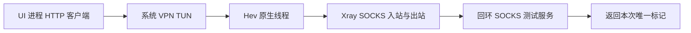

# 核心集成与本机转发验证

日期：2026-09-07。设备仍为 Pura 80 Ultra / LMR-AL10 / API 26。

## 已确认的结果

Windows 宿主实际编译得到纯 C Hev 2.9.0 和 Go Xray 25.8.3 的 OHOS ARM64 动态库，并在真机成功加载和运行。无需 WSL。

测试客户端访问 `http://198.18.0.1:18080/probe/<runId>`。目标地址没有真实监听器，流量被受限 VPN 路由捕获。
测试服务只监听 127.0.0.1，且仅接受上述虚拟目标和本次标记；没有通用外部代理转发功能。
仅 VPN 扩展进程调用 protectProcessNet，UI 客户端进程不受该保护，因此必须经过 TUN 才能得到响应。

- Hev 闭环：runId `1788783775599`，HTTP 标记匹配，服务端成功请求数为 1。
- Xray+Hev 闭环：runId `1788783796513`，同时有 XRAY_VERSION 25.8.3、XRAY_STARTED、HTTP 标记、HEV_STOPPED、XRAY_STOPPED、网卡销毁及扩展退出证据。
- 0.3.0 加入 CA 与导入代码后的重新启动验证：runId `1788784920928`，同一闭环再次通过。

证据：`build/device-tests/20260907-082252-Hev.log`、`20260907-082313-Xray.log` 及各自 `*-result.json`；0.3.0 对应 `20260907-084245-Observe.log`。
一次回归检查因未取得新请求日志被自动判为失败，没有沿用界面的旧通过结果。重新启动应用后获得了新 runId 和完整成功日志。

## 产物来源与 ABI

| 部件 | 来源版本 | 源产物 SHA256 |
| --- | --- | --- |
| Hev | 2.9.0 / 99cd2d5d5dfc9b21038e977808e59a0b90b38fa0 | fd43fe8e11567d658f2ff0fcc0e70ea5d4a434ec193a1f485bc8576f9c80fc2f |
| libXray | 20d70a98a1eef5227252894fa8e08c9e52a67ad6 | 3fc5c730724a57d0bfacb8a81d92b02ce1a8892dd28a533f5d030f0a015de5f0 |

Xray 内含 v1.250803.0 核心。OHOS Go fork 为 `302a5306b6fad2f47196360b82561d1db1f954cf` / Go 1.24.5，由官方校验过的 Windows Go 1.24.6 引导编译。
Xray ELF 检查确认 AArch64、PT_TLS 和 TLSDESC；不包含不兼容的 IE TLS 重定位。全部模块通过 go mod verify。
Hev 无额外 Go runtime。Xray 返回的 C 字符串统一经 CGoFree 释放，动态库在进程存活期间不卸载。

`build/native/*-verification.json` 是构建证据；完整重定位清单单独保存，避免把大型输出塞入摘要。相关第三方许可证保留在 `native/`。

## 生命周期限制

Hev 主循环是阻塞函数，运行在独立线程。桥接层复制 TUN FD，先停止并 join，再关闭复制的 FD；原始 FD 仍由 ArkTS 关闭。
早停会在限定 5 秒内重试 quit，超时不销毁仍在运行的线程所有权，随后由扩展进程退出兜底。
本阶段没有使用 Hev 的无锁全局统计接口作为成功证据，而是使用真实 HTTP 标记和测试服务原子计数。

固定版 Xray metrics 不能在同一 Go 进程重复注册，Close 也不完全关闭 metrics listener。因此每次测试结束都销毁 VPN 扩展，下次使用新进程；不能直接扩展为同进程无限重启。

## CA 与导入

应用打包了来自官方 curl.se 的 Mozilla CA 快照，121 张证书，SHA256 `f66dff1bdf8f96060b8177976f8b7d9254bc89bc4db933d769f7384d28480bc9`，与官方校验一致，Python/OpenSSL 逐张解析通过。
CA 文件复制到应用私有目录，并在首次加载 Go 运行时前设置该进程的 SSL_CERT_FILE；没有更改系统证书库或关闭证书验证。
这仍需通过真实 TLS 节点握手验证，不能由本机明文 HTTP 闭环推断 TLS 成功。

导入解析器的 46 个合成离线测试全部通过，且实际 SDK 26 ArkTS 编译通过。离线测试替换了 SDK URL/Base64 API，不等于真机解析或节点连接已通过。

## 当前待验收

0.3.0 已提供用户本地导入入口。节点联网测试仅覆盖本应用 IPv4 HTTPS，计划联合检查 HTTPS 成功与 Xray 节点出站上下行计数增量。
在用户导入并实际执行前，不记录外部节点、网络 TLS、全局代理、DNS、IPv6、UDP、吞吐或长期后台运行通过。
