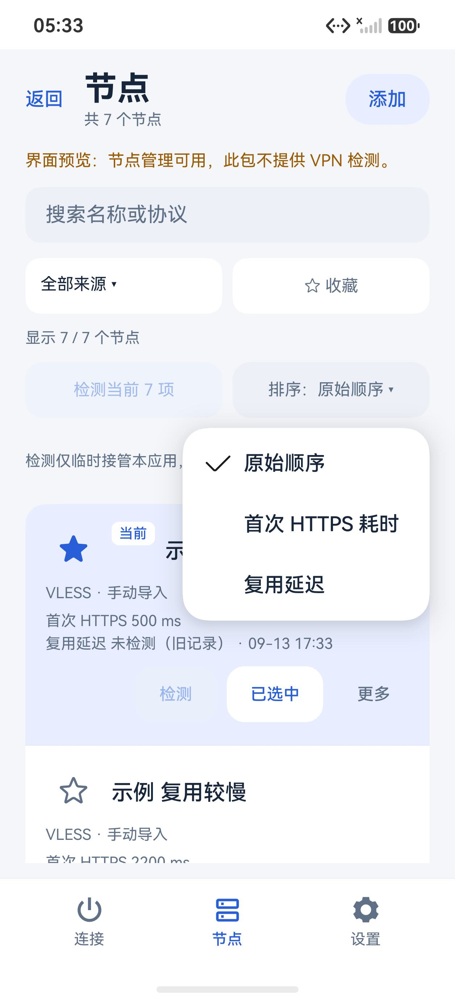
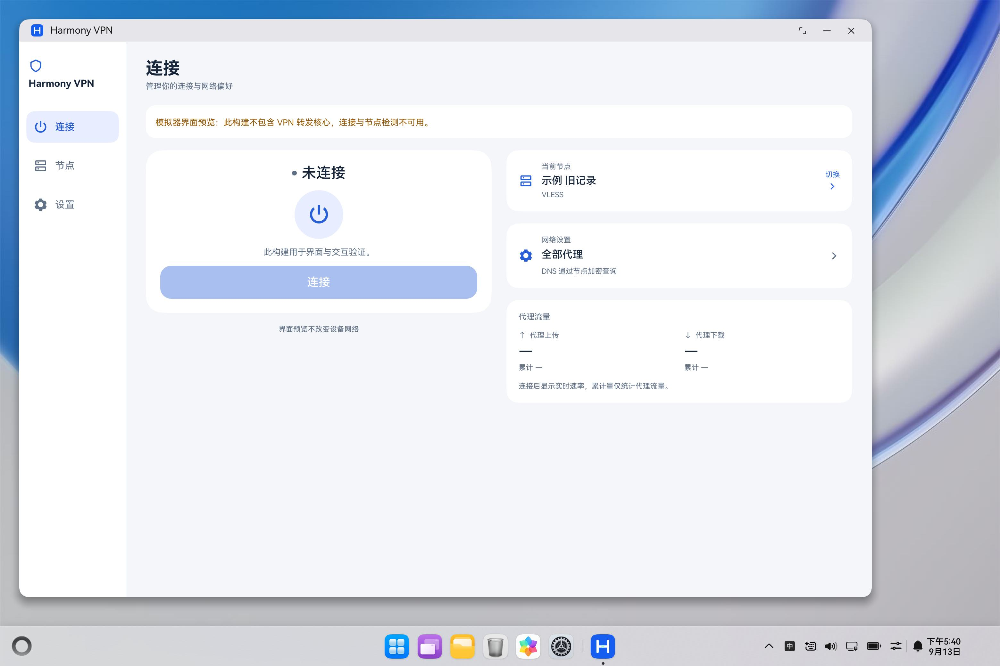

# 0.17.0：实时代理网速与节点排序

本轮实现首页实时代理上传、下载速率，以及节点列表的三种排序。版本为 0.17.0/code38，最低 API 24、目标 API 26；不改变节点配置、DNS、分流、测速请求或原生核心。以下记录来自 2026-09-13 的验证。

## 首页代理网速

使用同一次连接的两份核心累计字节快照，以字节差除以 `sampledAt` 时间差计算每秒速率。服务约每 2 秒产生新样本，页面每秒读取；重复读取同一份有效快照不会制造零值或重复计算。显示单位按 1024 换算，保留累计量和连接时长。

仅统计 `nodeProxy` 代理出站，规则直连流量不在其中。数值是最近采样区间的平均速度，不能等同于网页下载速度、所有系统流量或带宽测试结果。

新连接、重连、页面返回、缺失或超过 6 秒的样本、时间回退和字节计数重置都会重新建立基线。尚无有效区间时显示“—”；已取得有效区间且没有流量时显示零。速率只保存在页面内存，不增加磁盘记录。

## 节点排序

排序菜单提供原始顺序、首次 HTTPS 耗时、复用延迟。首次模式使用首次成功请求；复用模式仅采用测量版本 2、第二次请求成功且系统确认 `reused` 的结果。在复用模式下，旧记录、新建连接、复用未确认、失败或尚未检测的节点排在有效指标之后，保持原顺序；相同耗时也保持原顺序。

排序与搜索、来源及收藏过滤组合，只改变显示副本，不写入节点库、不改变当前节点或已开始的批量检测队列。指标仍通过配置指纹匹配；配置更新后不会沿用旧节点的检测值。

## 验证状态

### 离线与构建

12 套件合计 536 个合成用例／场景通过，包括速率 58、排序 32、节点页面 158、连接会话 69 等。9 份已有报告的源码哈希与本轮冻结逐项一致后复用，另补跑 3 套件；这些是合成执行，不是 536 次设备测试。过程中发现并修复设备工具对其他 Offline 设备的误判，另外通过 17 项 JavaScript 设备选择检查及 PowerShell 合成夹具检查。

| 变体 | 大小 | SHA-256 | 核验 |
| --- | ---: | --- | --- |
| ARM64 完整核心 debug HAP | 41,117,063 B | `b946571ad6da814917a75eee1807cb7186c39e5ce55e314ecb66b86319def299` | 13/13 |
| x86_64 界面预览 debug HAP | 3,277,024 B | `c0432516dfc41bb68d7bbc754a151fe3c35e63f8135e2d361756eb4d590859ba` | 15/15 |

108 个构建输入的冻结摘要为 `4259e63d17ed2f564652e253661b0eac8ca8e348e45902d17fe67660e29a9be8`，构建前后及暂存核对一致。预览仅有既定的版本标记、架构和能力开关变换。签名是本地调试签名，不是商店 Release。

本地证据位于 `build/phase21-offline/summary.json`、`build/phase21-arm64/candidate1-20260913T092915Z/verification.json` 和同编号 `phase21-preview` 目录；构建产物、签名和原始日志不随源码发布。

### 三类模拟器

- 手机普通与两倍字号检查首页速率占位、累计量、菜单及当前选择标记。首次排序顶部为 300/400 ms，复用排序顶部为确认复用的 180/280 ms；回到原序仍保留当前节点。
- 平板双栏首页在普通和两倍字号均可读。普通字号三种排序都滚动核对了完整 7 项；两倍字号的复用模式核对了完整顺序，另两模式核对顶部结果与菜单。
- PC 检查 1400 vp 宽窗口与 360 vp 窄窗口，包含窄窗两倍字号。桌面原生菜单可以延伸到应用窗口外，选项在屏幕内完整可见。

7 条合成数据包含旧记录、两条确认复用、新建连接、复用未确认、失败及未测情况。界面预览显示“—”，没有产生真实代理流量。两次工具因控件已滚出视口而拒绝点击，重新滚动使控件可见后完成验证；没有因此修改业务逻辑。

三个模拟器均已关闭，临时镜像目录引用已清除。平板的合成文件通过修正后的 debug mount 相对路径删除，并独立读回确认不存在。手机和 PC 再次冷启动后应用及目录已不存在，因此重装同一预览包、未重新加入数据，再独立确认当前空库；这不等于证明前次删除命令有效。该工具收尾差异记录在本地 `phone-pc-fixture-cleanup.json` 中。

后续修正：上述路径清除只描述本阶段当时对配置文件的操作。阶段二十二发现 qcow2 仍依赖原基镜像目录，已保留该依赖并修复路径不一致；没有清空数据盘。详见[模拟器环境修复](phase22-session-recovery.md#模拟器环境修复)。

### API 26 手机

从 0.16.0 覆盖升级到上述 ARM64 包，当前 1 条节点、当前选择、网络与外观设置及检测历史均与新建基线逐字节一致。首次采样观察到下载显示 278.5 KB/s，与对应 2,130 ms 区间的字节增量换算一致；空闲时显示有效零值。UI 与服务是异步采样，该对照是数值支持证据，不是整机带宽基准。

同一测试会话完成一次重连；累计量继续保留，速率恢复采样。执行后台操作约 39 秒后，独立确认应用不可见、没有焦点，返回后同一会话继续通过代理 DNS 和域名 HTTPS 检查。最后正常断开，服务写入本轮 `destroyed / cleanupConfirmed=true`；速率恢复为“—”。真机另实际切换复用排序并恢复原序，随后回读确认当前节点、配置和历史仍完整保留，服务进程已退出。

升级前发现旧会话停留在数小时前的 `destroying / cleanupConfirmed=false`，但首页显示连接已结束、旧 PID 已不存在。安装采用独立的非活动状态证明，并原样保留旧回执；不把进程退出改写成历史清理成功。本轮最终成功回执属于新版的新会话。对应本地记录为 `build/phase21-phone/completion.json`、速率记录和 `background-verification.json`。

本轮仅验证这一台手机与当前节点，没有切换系统网络，也没有改变 DNS 模式。预览包不能用于 VPN 联网验收；API 24 平板、鸿蒙电脑联网、所有协议及长期续航不在本轮结论中。
