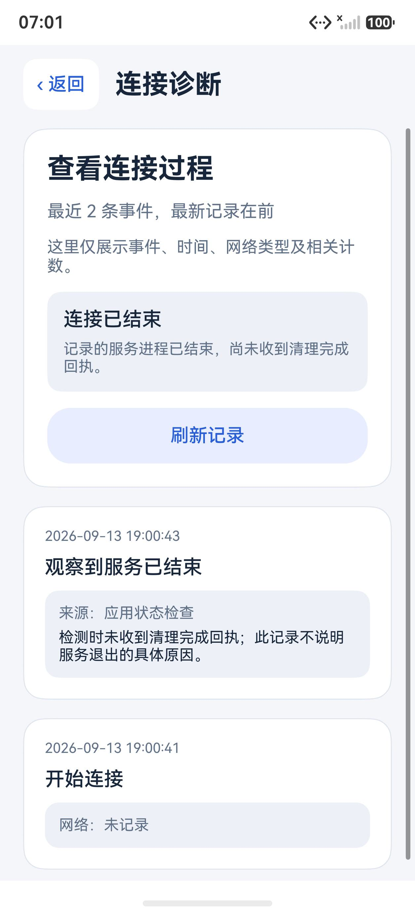

# 0.18.0：异常退出后的状态与恢复

本轮统一首页、节点操作限制和开发验证入口对连接生命周期的判断，并在诊断页展示当前状态与服务退出观察。版本为 0.18.0/code39；不改变 DNS、分流、节点配置、测速请求或原生转发核心。

## 状态含义

服务自己的清理回执与应用对进程的观察分别保留。服务可能在异步清理完成前退出，因此“记录的服务进程不存在”不能追溯为所有清理步骤完成。

- 同一会话收到 `destroyed / cleanupConfirmed=true` 时，按正常清理完成处理。
- 记录的服务 PID 明确不存在且缺少完整清理回执时，显示“连接已结束”，允许重新连接，并保留原始服务记录。
- 旧 UI 所有者、心跳过期、PID 查询失败或无有效 PID，都不能单独证明服务退出；状态未确认时提供恢复操作，保留连接和编辑限制。
- 已取消、没有服务回执的启动请求可以重试；过期的旧授权请求先显式撤销，防止迟到请求建立 VPN。
- 新会话的命令与状态按 runId 匹配；旧页面、迟到授权及恢复操作不能替换新的连接请求。

节点检测也采用同样的生命周期判断。原有“开始下一次临时 VPN 前等待已观察服务 PID 退出”的额外门槛继续保留；异常退出会结束旧检测队列，重新打开应用不会自动接续队列或建立连接。

## 诊断记录

`connection-status.json` 和 `diagnostic-journal.json` 继续由 VPN 服务写入。应用把明确的退出观察单独保存到 `connection-recovery.json`，最多 50 条、32 KiB，按会话、服务 PID 和原状态时间去重。记录仅包含固定分类与必要标识，不保存节点、原始错误或退出原因猜测。

保存前后重新核对当前会话；原文件损坏或写入失败时保留原记录。诊断页合并服务事件与观察时间线，并明确标注“检测时未收到清理完成回执”。观察写入失败不会阻止重新连接。

## 验证结果（2026-09-13）

### 合成回归与构建

8 套件共 551 个命名合成用例通过：生命周期 79、恢复观察与诊断 65、连接会话 102、节点页面 168、实时速率 58、服务诊断日志 17、批量队列 38、测速服务 24。另外，节点操作限制通过 11 组、180 个状态组合，分别检查两个公开入口。报告与当前源码哈希已核对；这些计数不是设备运行次数。

| 变体 | 大小 | SHA-256 | 核验 |
| --- | ---: | --- | --- |
| ARM64 完整核心 debug HAP | 41,173,206 B | `89ac043c18ed81a515a676c7e65d9a23d3e7b9fcc1a99f4fac17bcd0aeba96f1` | 13/13 |
| x86_64 界面预览 debug HAP | 3,333,159 B | `f3539e858828c02d334fa9a9df922306da29ccf963638b86bef2ac0cbb9ba448` | 15/15 |

110 个构建输入的冻结摘要为 `22d088fb2128bdf489c162eb5c78cf8ca382a86806f695bba10233a9865b390c`。两包来自同一冻结，预览仅作既定版本、ABI 和能力开关变换。构建记录位于本地 `build/phase22-arm64/candidate1-20260913T103405Z`、同编号 `phase22-preview` 和 `build/phase22-offline/summary.json`。调试签名及 HAP 不随源码发布。

### 实际模拟器界面

在两个独立的手机、电脑模拟器实例中安装上述预览包。手机使用合成状态检查：正常完成、服务退出但未收到清理回执、残留测速状态，以及记录 PID 仍存在的未知状态。前三者分别显示“未连接”或“连接已结束”；未知状态保持保守。退出观察去重，原服务状态文件字节不变。电脑主要复验服务退出后的恢复与诊断页面在宽窄窗口中的显示。

诊断页在普通和两倍字号可读；电脑检查 1400 vp 宽窗及 360 vp 窄窗。共保存 16 张筛选截图；测试后的 7 个状态文件恢复并独立回读，节点页为空，两个测试实例均已关闭。记录在本地 `build/phase22-emulators/summary.json`。

本轮没有新增平板界面运行。模拟器中的“存在 PID”使用预览应用自身进程来建立存在证据，不是真实 VPN 服务；预览没有发起 VPN 联网。

### API 26 手机

保留当前选中节点、节点目录、网络设置、外观和测速历史，从 0.17.0 覆盖升级到上述 ARM64 包。共进行了 6 个测试会话，每个都通过代理 DNS 与 HTTPS 检查：

- 两次通过系统应用管理命令强制结束整个应用。服务进程退出而清理回执未确认；重新打开后没有自动连接，首页允许再次连接。
- 对后一次退出独立核验：服务退出后的原始回执字节保持不变，保存的对应观察恰好一条，诊断页显示“连接已结束”及观察说明。回到首页后可重新连接。
- 另外三个会话中的单服务终止尝试被工具或平台限制拦截，随后都正常断开。首次工具缺少可用的 `tr` 命令，改用内建读取并通过只读身份检查；直接信号被系统以 `Operation not permitted` 拒绝，`aa stop-service` 被扩展可见性检查拒绝（10103001）。这些尝试不计为单服务异常退出测试通过。
- 最后一轮重新连接、HTTPS 检查和正常断开通过，得到新会话真实的 `destroyed / cleanupConfirmed=true`，并确认服务 PID 已不存在。配置及测速历史始终与本轮新鲜基线逐字节一致，没有恢复旧节点备份。

真机完成的是“整个应用强制结束后恢复”，没有完成“保持 UI 存活时单独强制结束 VPN 服务”的平台操作；后者的状态判断由合成回归与模拟器覆盖。没有为测试修改手机权限或系统网络。证据在本地 `build/phase22-phone/completion.json`，原始配置、进程身份和界面树仅保存于 `.private/phase22`。

### 模拟器环境修复

初期启动停在宿主检查，后来确认是旧测试工具收尾时把配置路径换回 SDK，但 qcow2 仍依赖原测试基镜像目录，触发了隐藏的清空数据确认。按实际依赖修正了三个旧实例的三项镜像路径；12 个 qcow2 前后哈希一致，没有清空或重新基于其他镜像构建数据盘。该基镜像目录仍是数据依赖，已保留，不能当作可随意删除的缓存。

旧平板实例另有系统版本 7.0.0.105 与基础镜像 7.0.0.106 的差异，本轮未修改版本字段、启动或重置它；仅修正已证实的路径错误。实际界面测试使用新建的独立实例。环境证据与应用验证分别保存，见本地 `.tooling/phase22/emulator-ui/metadata-repair/verification.json`。
