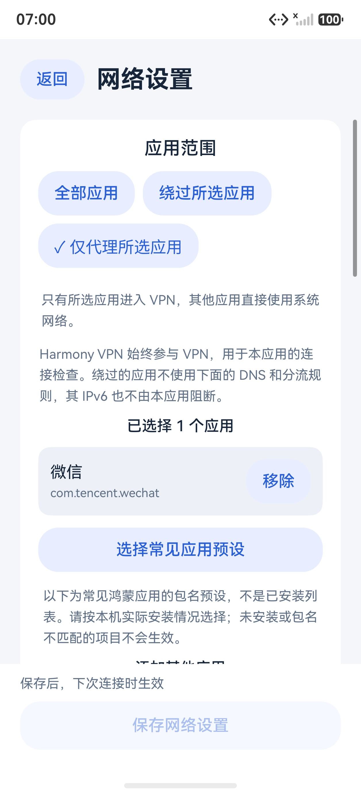
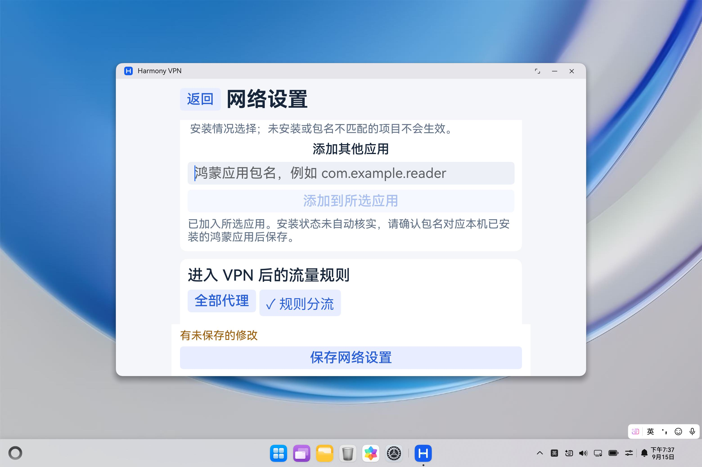

# 0.20.0：按应用设置代理范围

本轮在网络设置中增加“全部应用”“绕过所选应用”“仅代理所选应用”，应用范围与原有域名/IP 分流、DNS 设置分别管理。版本为 0.20.0/code41，未修改 C++、Xray、Hev 或节点协议。诊断摘要导出仍留待后续。

## 使用方式

先断开连接，在首页进入“网络设置”，选择应用范围。点击“选择常见应用预设”，按本机实际安装情况勾选，也可添加其他应用的完整鸿蒙包名。保存后，下次连接生效；没有选中应用时，两个按应用模式都会阻止保存。

- 全部应用：保持原来的全设备范围，已有应用选择保留但不启用。
- 绕过所选应用：所选应用使用系统网络，其他应用进入 VPN。
- 仅代理所选应用：只有所选应用进入 VPN，其他应用使用系统网络。

Harmony VPN 自身固定纳入范围，用于首页连接检查。节点连接仍由既有 socket 保护机制防止回流。对于进入 VPN 的流量，再按“全部代理”或原有域名/IP 规则选择出口；IPv6 继续捕获后阻断。绕过应用的流量与 IPv6 不由本客户端管理，不能把首页检查成功当作所有其他应用的联网证明。

## 应用选择的边界

常见应用列表是固定包名预设，不是已安装列表，也没有自动检测安装状态。微信、抖音、QQ、支付宝、美团、京东六个预设包名通过电脑调试在本轮开发手机上做过精确存在查询，这不代表每台设备或未来版本均已安装或保持相同包名。华为应用预设依据[官方包名列表](https://developer.huawei.com/consumer/cn/doc/content/themes-engine-next-base-intentcommand-0000002471235064)。

最终实现不申请应用查询或全量列表权限，也不调用受限的其他应用查询接口。预设浏览、搜索和手工包名校验均在本地执行，只保存所选包名，不上传。手工添加确认的是包名格式，安装状态由用户确认；保存的选择不会被后台检测静默删除。

初始 C1 曾尝试使用普通 `GET_BUNDLE_INFO` 权限进行精确查询；离线模拟通过，但模拟器中对确实安装的浏览器返回权限不足。进一步核对[官方 getBundleInfo 说明](https://github.com/openharmony/docs/blob/master/zh-cn/application-dev/reference/apis-ability-kit/js-apis-bundleManager.md#bundlemanagergetbundleinfo14)后，确认第三方应用需要特权查询权限，普通权限的级别说明不足以证明该调用可用。因此 C2 移除查询与新增权限，改用明确标注的预设；没有提升签名权限、伪造安装检测或把 C1 的离线通过当作设备可用。

应用范围按鸿蒙原生包名配置。未提供安卓容器内部各应用的单独选择，也未新增分身、共享 UID 或多用户的兼容承诺。包名变更或卸载后需手动修改或移除原选择；系统不能代理不存在的包名。

## 实现与数据兼容

`AppRouting.ets` 校验模式、包名和列表，并生成互斥的 `trustedApplications` 或 `blockedApplications`。两种名单由鸿蒙 VPN 原生配置支持；API 23 起每个名单最多 256 项，本项目最低 API 24，用户选择上限为 255 项，给客户端自身预留位置。[华为 VPN 接口](https://developer.huawei.com/consumer/cn/doc/harmonyos-references/js-apis-net-vpnextension)

空白名单不能用来表示“没有应用代理”，因此应用层明确拒绝空选择；仅代理模式总是包含客户端自身，避免无有效用户应用时扩大成全设备范围。包名不会转小写或静默截断。包名格式依据[官方应用配置规范](https://github.com/openharmony/docs/blob/master/zh-cn/application-dev/quick-start/app-configuration-file.md#配置文件标签)。

网络设置升级到 schema 2，新增 `appMode` 和 `appBundles`。旧 schema 1 严格按旧字段读取，仅在内存补充“全部应用”默认值；用户明确保存才写新结构。文件仍采用原有原子保存、断开门禁及 32 KiB 总大小限制。无效输入、尚未加入所选列表的包名和未保存返回确认不会改写原设置。

常驻服务在创建任何 VPN 对象前读取并验证一次策略快照，VPN 应用范围与核心的 DNS/分流使用同一份策略；恢复连接复用该快照，不在重连途中重新读取设置。节点延迟检测和仅本应用的临时验证保留原有隔离范围，不读取日常应用选择。

## 验证状态

初始 C1 的构建与离线结果单独保留，其受限查询不能作为正式功能通过。C2 已完成两种应用范围的真机浏览器出口对照。最终 C3 只修复手工添加后输入框回显擦掉成功提示的问题，已经覆盖安装到手机；两种候选的结果分别记录，不混写为同一安装包的运行结果。

### C3 最终构建与离线回归

| 构建 | 大小 | SHA-256 | 核验 |
| --- | ---: | --- | --- |
| ARM64 完整核心 debug HAP | 41,381,950 B | `27a65155900aeccbdc110394bc85d2f78bec663f4cdcaaef5ef4696b190ebe56` | 13/13 |
| x86_64 界面预览 debug HAP | 3,546,011 B | `bb686f2f30d06b11834d7639bc5c59c5a9b28e021c27224bad24cf75c287954f` | 15/15 |

116 个构建输入的冻结摘要为 `39edeb21e7f562da16332bfb7b3ebec498a78baca12dde512936dd0e20e0ad55`。两包来自同一冻结，预览仅执行既定的版本后缀、ABI 与 VPN 能力变换；最低 API 24、目标 API 26。权限独立核对确认只保留原有 INTERNET 与 GET_NETWORK_INFO，未申请应用查询权限。记录位于本地 `build/phase24-{arm64,preview}/candidate3-input-feedback`。

C3 汇总为 398 项合成／实际方法测试及单列 14 项 AST 检查，全部通过。包括策略 40、连接会话 137、核心流程 33、测速会话 27、核心恢复 19、速率 58、网络设置方法／事件 78、纯预设 6；AST 为网络设置 3 与自适应页面 11。未受影响的 7 套报告按源码与脚本哈希复用，表单与自适应报告重新绑定 C3。没有将旧 SDK 查询用例继续算入当前覆盖。汇总位于本地 `build/phase24-offline/candidate3-input-feedback/summary.json`。

### 模拟器界面

C2 手机模拟器已实际检查空选择拒绝保存、勾选微信预设后的 include/exclude 保存与重进保留，以及首页范围摘要。独立读回确认原有 schema 1 中的 DNS、规则模式、局域网选项和三类规则在保存为 schema 2 后语义不变。

C2 手机和电脑还检查移除最后一项后的保存限制、全部应用模式保留已选列表、宽窄窗口及两倍字号。PC 手工添加成功后选中列表正确，但提示曾被程序清空输入的回调擦掉，这一项在 C2 摘要中保留为失败。C3 为输入回调增加同值返回保护，并在独立 PC 实例中重新验证：成功提示在清空输入后保留，新输入仍会清掉旧提示；普通和两倍字号全文可读。相关摘要分别位于本地 `build/phase24-emulators/candidate2/summary.json` 和 `candidate3/15558/summary.json`。

两轮模拟器验收都使用新鲜基线；各实例的 12 个文件恢复后独立回读确认，测试实例已经关闭，没有修改底层镜像依赖。本轮没有新增平板模拟器或真实平板／电脑的 VPN 联网验收。

下图仅展示 C2 模拟器中的示例选择。预设并不代表微信已安装或联网；x86_64 预览没有 VPN 核心。

下图为 C3 的两倍字号手工添加反馈，使用合成包名，验证提示不会在程序清空输入后消失。

### 真机的实际出口对照与最后升级

API 26、ARM64 手机使用当前已保存的有效节点，从 0.19.0 覆盖升级至 C2。C2 ARM64 SHA-256 为 `8dde85e06e00115641ff7e03ba12b94f2ab284f96f6ef333cd8524f80ad44750`。测试前建立新的私有基线，原节点、当前选择、外观与测速历史按字节保护；网络设置修改及恢复均通过应用界面完成。

| 配置 | 本应用检查 | 独立华为浏览器请求 | 结果 |
| --- | --- | --- | --- |
| 仅代理浏览器 | DNS 与 HTTPS 成功，IPv4 出口 | IPv4，出口校验标记与本应用一致 | 观察到浏览器纳入代理 |
| 绕过浏览器 | DNS 与 HTTPS 成功，IPv4 出口 | 使用 IPv6，与本应用出口不同 | 观察到浏览器绕过 VPN |

浏览器由本应用打开带唯一时间参数的 Cloudflare HTTPS 地址。验证固定浏览器包名、页面主机、HTTPS、响应时间与完整地址的时间参数；地址栏折叠查询参数时，只展开读取其当前 URL，不输入或提交地址。原始地址、出口 IP、标记与界面树仅留在私有测试目录，公开结果只记录一致性和地址族。这里的结论限于实际观察的浏览器请求，没有逐个登录或测试微信等社交／支付应用，也不能外推为所有协议、分身或多用户均通过。

两轮连接均正常断开，最后确认本轮服务清理完成且 PID 不存在。原应用范围、DNS 和三类规则恢复原语义；网络策略可能因明确保存从 schema 1 迁移为 schema 2，因此不声称该文件与升级前逐字节相同。节点、当前选择和测速历史仍按字节保持。结果在本地 `build/phase24-phone/completion.json`，其中 `acceptanceComplete=true`。

C3 相比 C2 的 116 个构建输入仅 `NetworkSettings.ets` 的输入回显处理改变，服务、策略、核心及原生输入全部相同。最终 C3 已再次覆盖安装到手机，通过本地配置检查；新鲜基线中的节点、网络策略、历史及原控制／清理回执按字节保持，未再创建 VPN。该升级结果单独记录于 `build/phase24-final-phone/completion.json`，不把 C2 的浏览器请求记成 C3 重新运行。
