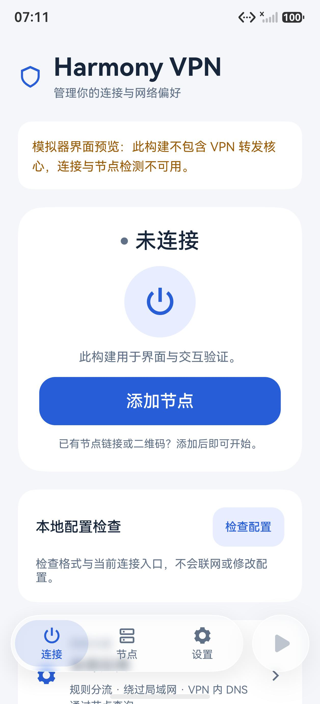
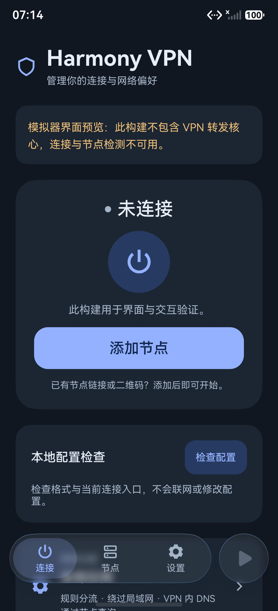

# 0.21.0：悬浮玻璃导航与页面边缘

底部保留“连接、节点、设置”三个入口，改为悬浮胶囊，并在右侧提供独立的圆形连接／断开按钮。滚动内容延伸到导航后方，胶囊之间和周围不再铺设整条实色背景。宽窗口继续使用侧导航。版本为 0.21.0/code42，未修改 C++、Xray、Hev、DNS 或应用代理范围。

## 布局与材质

`GlassDockLayout` 使用横向 `Tabs` 的自定义底部栏，通过 `barOverlap(true)` 让底栏叠在实际页面内容上。显式关闭 Tabs 默认的整片厚模糊背景，只对胶囊和圆形按钮设置材质。这个容器仅承载当前页面，三个入口继续使用原有路由，不维护另一套页签状态。

API 26 支持时，惰性加载 `uiMaterial` 并使用超薄沉浸材质；系统光感、阴影和圆按钮交互形变由系统处理。普通组件的系统材质只在指定标题栏或底部页签区域生效，因此不能仅将普通 Row 放进 Stack 后调用材质接口。[官方开启方式](https://developer.huawei.com/consumer/cn/doc/HarmonyOS-Guides/arkts-immersive-light-sense-enable)

API 24/25 不加载新系统模块；能力不支持或加载失败时，使用半透明底色、背景模糊、细亮边和轻阴影。图标和文字自身保持不透明。具体系统材质效果仍会受设备与用户的系统效果设置影响，代码中能力检查成功不等于已经证明实际渲染。

首页和设置页的滚动区域向上下系统安全区延伸绘制，保留初始内容避让；节点页保留固定标题，仅扩展列表底部绘制。内容尾部按实际测得的导航高度留白，使两倍字号下的最后一项也能滚到导航上方。普通二级页面使用主题背景延伸，网络设置的固定操作区单独处理底部颜色衔接。没有全局强制全屏或隐藏系统栏。

`TabContent` 与内部 `TabBar` 有独立的裁切设置：只关闭外层裁切，仍会把胶囊阴影切在手势区边界。最终使用 `barModifier` 关闭内部栏的裁切，保留按钮自身的布局与点击范围。顶部则根据本窗口实际状态栏高度绘制半透明主题渐变，减弱滚入文字对系统时间的干扰；监听避让区与窗口变化，销毁时解绑，电脑窗口不增加这个遮罩。

## 快捷启停

圆形按钮复用首页原有连接与断开流程。节点页或设置页先产生明确的连接／断开意图，再返回首页；首页重新核对会话、状态与请求时效后执行。请求只在内存中保存，五秒过期、消费后清除，导航失败可取消，避免旧请求落到另一次连接上。

临时检测、尚未确认的清理状态和预览构建不允许直接快捷启停。首页原有主按钮继续保留。外观修改没有增加节点读写、权限或远端数据上传。

## 验证记录

较早 C1/C2 的实色胶囊仅验证过背景颜色衔接，用户指出其仍有整条实色底栏，因此不作为本次设计目标完成的证据。C3b 首次观察到真实玻璃后景；C3c 解除了滚动内容的安全区裁切，但仍有标题叠字及阴影硬切；C3d 的普通滚动边缘消隐不足以解决叠字。当前 C3e 针对内部栏裁切和状态栏过渡分别修正，候选证据不混用。

### C3e 构建与离线检查

| 构建 | 大小 | SHA-256 | 核验 |
| --- | ---: | --- | --- |
| ARM64 完整核心 debug HAP | 41,461,695 B | `3d3ca13779cde402c947fe4efebaba161877f80531e829843624b6113f99ee57` | 13/13 |
| x86_64 界面预览 debug HAP | 3,625,745 B | `941f5dd1927d96051066c5376722a4092cd7eb3988f13db054af7add3f4e2bd6` | 15/15 |

123 个构建输入冻结为 `92d93df261927ee7502345e5f09c947da99b6e791d976986cc3e97a4b8d06451`，两个包来自同一冻结；最低 API 24、目标 API 26，原生库未重建。记录在本地 `build/phase25-{arm64,preview}/candidate3e-glass-shadow`。

11 套离线检查共 415 个执行用例、36 项单列静态检查通过，覆盖快捷操作、原连接会话、材质能力降级、外观、窗口与避让区生命周期、相关表单及实际父层连线。40 个实际源码依赖与当前冻结一致；未变套件按源码、脚本、依赖与报告哈希复用，受影响套件重跑。离线结果不代表设备渲染、API 24 真机或联网验收。记录在本地 `build/phase25-offline/candidate3e-glass-shadow/summary.json`。

### 实际界面与手机

手机模拟器完成深色、浅色及当前系统模式检查，确认内容经过胶囊后方、底部阴影连续、系统时间清晰；一倍和两倍字号下实际切换三个入口，并点击设置末项与合成节点末项。电脑模拟器检查 360 vp 窄窗和 1400 vp 宽窗、两倍字号与末项操作，宽窗保留侧导航和窗口标题控件。电脑窄窗中后景文字较清晰，按用户明确偏好保留当前通透程度；没有增加实色遮罩，也不宣称各设备 GPU 模糊强度相同。

20 张最终候选模拟器截图按包哈希绑定。两台模拟器分别恢复本轮新鲜基线的 12 个文件并独立读回，随后关闭；没有重置或删除底层镜像依赖。记录在本地 `build/phase25-emulators/candidate3/candidate3e-summary.json` 和 `cleanup.json`。本轮没有新增平板模拟器或 API 24 真机验收。

API 26、ARM64 手机已覆盖安装 C3e，读回确认原节点、选择、网络设置及历史保留。实际查看浅色、深色、当前系统模式及设置末页：玻璃效果保留，用户指出的底部色差横线消失。旧截图在手势区边界前后有约十级 RGB 跳变；新截图同位置为连续的 `(236,237,241)`，之后逐渐恢复页面底色，结合原图目视确认是连续阴影。像素采样仅作为这次位置对照的支持证据，不替代所有屏幕与内容的视觉测试。

手机从设置页点击新圆形按钮启动一次日常连接，返回首页后通过本地预检、代理 DNS 和 HTTPS 检查；再到节点页点击新圆形按钮结束同一连接，返回首页，收到真实清理完成回执，并独立确认服务进程不存在。未使用原首页主按钮替代快捷按钮验收。

手机验证使用新的保留基线，用户测试期间新选的浅色偏好作为最终恢复目标，不回写旧测试中的深色选择。节点、网络策略、测速与恢复历史逐字节保持；诊断日志只增加本轮正常连接事件，并遵循原有容量上限。最终已恢复浅色、保持断开。自动验收、截图视觉检查及底部采样分别记录于本地 `build/phase25-phone-glass-final/{completion,visual-review,bottom-light-sampling}.json`；原始真机图片与配置不公开。

最终完整性核验已通过，绑定当前 123 个源码输入、11 套离线报告、两个签名包、20 张模拟器原图、24 个模拟器文件恢复及两台实例停止回执，并分别核对手机自动检查和逐张图像检查记录。结果为本地 `build/phase25-final-integrity-candidate3e-glass-shadow.json`。这不表示新增了平板／电脑的真实 VPN 联网、全部系统版本或长期续航验收。

实际视觉检查必须包含两次滚动位置：内容经过固定胶囊后方、材质随后景变化、前景图标文字清晰，以及末项完整露出并可操作。仅检查上下像素颜色相同不能证明悬浮玻璃效果。公开截图只采用模拟器中的空白或合成数据；用户参考图、真机截图和节点数据留在本地私有目录。
