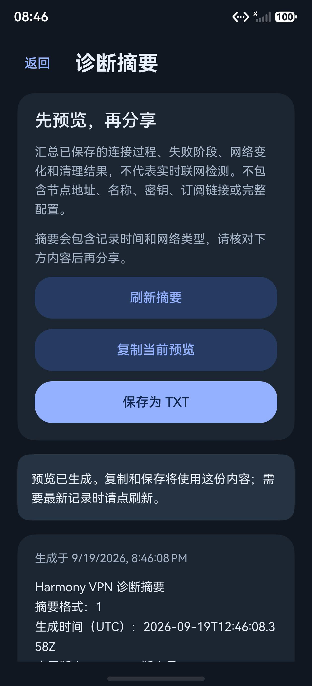
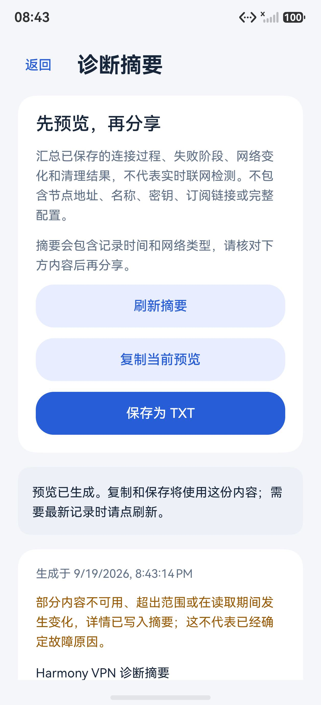

# 0.22.0：诊断摘要预览、复制与 TXT 导出

在“设置 → 连接诊断”中点击“预览诊断摘要”，可查看当前生成的记录快照，再复制或保存为 TXT。复制和保存始终使用屏幕上的同一份预览；需要更新记录时，用户主动点击“刷新摘要”。版本为 0.22.0/code43。

## 摘要内容与边界

摘要按白名单重新组织数据，包含应用版本、系统 API、生成时间、记录范围、网络类别、固定事件和失败分类、恢复次数及清理回执。会话仅在这份摘要内编号，内部会话标识和进程标识不直接导出。

不导出节点名称、服务器地址、端口、UUID、密钥、订阅链接、配置指纹、应用包名列表、原始异常或完整配置／状态对象。未知字段不会因为存在于 JSON 中就进入报告；读取、解析和输出均设大小限制。服务日志最多 200 条，恢复观察最多 50 条，因此摘要不是完整历史。

最近保存的状态与实时连接状态分别表达。生成摘要不会探测服务进程、启动 VPN 或发起联网检测；一个阶段失败不能直接确定远端故障根因，观察到服务退出也不能替代服务的清理回执。采集期间出现会话或状态冲突，会标明本次信息不完整并提示重新生成。

新的只读 inspection 接口区分未找到文件、有效空记录、有效记录、格式异常及读取失败。既有日志和恢复记录的读写接口保留原有行为，新页面不会为了显示摘要修复、清空或重写这些文件。

## 复制和保存

复制操作创建纯文本剪贴板数据，并设置为仅本机共享；不读取用户原来的剪贴板内容。写入所用设置遵循本地 SDK 的 `ShareOption.LOCALDEVICE` 定义。[华为剪贴板接口](https://developer.huawei.com/consumer/cn/doc/harmonyos-references/js-apis-pasteboard)

保存通过系统文件选择器指定目标 TXT 文件，不自动写入固定目录。写入后重新打开刚选中的 URI，核对 UTF-8 字节、长度与文件末尾；取消、写入失败和写后核对失败使用不同提示。页面返回或销毁会使旧操作失效，文件选择器引起的暂时隐藏不会取消保存。[华为文件选择器](https://developer.huawei.com/consumer/en/doc/harmonyos-references/js-apis-file-picker)

摘要仍包含使用时间及网络变化记录，页面在复制或保存之前说明这些内容。是否进一步分享由用户决定；应用没有自动上传或发送报告的流程。

## 验证记录

首个候选因剪贴板枚举拼写与 SDK 不一致而编译失败，未安装设备。C2 构建和离线测试通过，但实际设备打开摘要时生成失败；原测试没有覆盖 OHOS 空字符串编码的返回差异。C3 改为从零累计已追加的 UTF-8 字节数，每次只编码非空新行，并补入对应模拟测试；随后真机与模拟器均成功生成。各候选证据独立保留，不将 C2 的离线通过描述为功能验收通过。

### C3 构建与离线检查

| 构建 | 大小 | SHA-256 | 核验 |
| --- | ---: | --- | --- |
| ARM64 完整核心 debug HAP | 41,569,976 B | `4bf3c48536a4c06eac194eda4c8205948cf3edcc65091b703b82aa351f7a7d8c` | 13/13 |
| x86_64 界面预览 debug HAP | 3,734,027 B | `111d4a1ac47d151162187f0645c62bd1ab92361a440e035a8ecc2dfa6eef2bf0` | 15/15 |

126 个构建输入冻结为 `72050a2430f0a57a45804df9a00e8cf28f7d6ca05016402f06925a7854576915`。两个包来自同一份源码冻结，最低 API 24、目标 API 26；没有重建原生库，也没有增加权限。证据在本地 `build/phase26-{arm64,preview}/candidate3-summary-bytes`。

11 套相关离线检查共 **408 个执行案例、17 个静态检查**通过，包含摘要 42、日志 19、恢复记录与诊断页 73、导出 31、摘要页 23、入口方法 3、连接会话 149、核心流程 33、核心恢复 19、原文档 I/O 16；摘要页、入口和自适应静态检查另列。未变化的套件按源码、脚本、实际读取依赖及报告哈希复用。记录在本地 `build/phase26-offline/candidate3-summary-bytes/summary.json`，不重复计算内部循环、构建核验或手机辅助脚本检查。

### 模拟器

手机模拟器实际检查空记录、正常事件序列、损坏日志、混入额外字段的日志、损坏恢复记录、有效退出观察六组数据；预览未带出测试凭据、原始会话编号或 PID。缺失和空记录不显示成已确认正常，退出观察不替代清理回执。文件系统读取权限失败由离线故障注入覆盖，没有修改设备文件权限制造故障。

手机与电脑均检查复制成功反馈和文件选择器取消。手机覆盖深浅色及一倍／两倍字号，电脑覆盖 360 vp 窄窗、1400 vp 宽窗与两倍字号，按钮及长文本可滚动访问。电脑选择器的系统返回键只导航目录，因此实际点击其取消按钮，并检查返回应用后的取消反馈。

两台模拟器各 12 个文件均恢复本轮新鲜基线并独立读回，测试实例已关闭。7 张原图按当前预览包和图片哈希绑定，公开图片仅含空白或合成数据。记录在本地 `build/phase26-emulators/candidate3-summary-bytes/{summary,visual-review,candidate-result}.json`。本轮没有新增真实平板／电脑联网或 API 24 真机验收。

### 真机

API 26、ARM64 手机已安装最终 C3，实际生成一份 16,378 字节摘要，独立检查固定格式及危险字符串，并对预览和保存成功页面进行视觉检查。复制返回成功反馈；随后在系统选择器中选择本机 Documents 文件夹，保存 `harmony-vpn-diagnostic-summary.txt`。应用重新打开所选文件，逐字节、长度和 EOF 核对与同一份预览一致。

复制证据是系统写入调用完成后的应用反馈，未独立读取系统剪贴板，也没有读取用户旧剪贴板。TXT 的核对由应用执行，调试辅助工具没有另行读取外部文档；这两个边界在完成回执中保留，不将其夸称为工具独立回读。

最终返回首页，节点、策略、历史、外观及原控制／清理回执等 12 个文件逐字节保持，原服务进程仍不存在。本轮没有启动新 VPN、切换网络或发送配置。原始截图、布局及报告内容只留在本地私有目录。证据在 `build/phase26-phone-c3/{upgrade,preview,copy,completion,visual-review}.json`。

最终完整性核验在本地 `build/phase26-final-integrity.json`，绑定当前源码、测试脚本／报告、两个 HAP、真机回执及模拟器恢复／停止记录。

