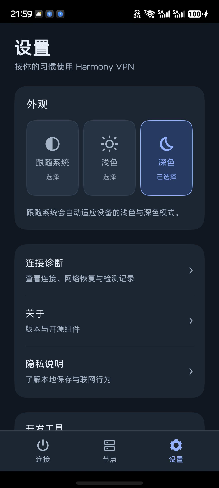

# HarmonyOS Network Connector

使用 ArkTS / ArkUI 构建的鸿蒙原生节点管理与 IPv4 代理客户端，集成 Xray 26.6.1、Hev SOCKS5 Tunnel 2.9.0 和本地适配的 Go 1.26.7 工具链。

应用显示名称为 **Harmony VPN**，当前版本为 **0.10.0**。这是独立的开发项目，参考 v2rayNG 的功能与分享链接格式，不是 v2rayNG 或华为的官方客户端。完整 Android 功能对等和商店发布尚未完成。

## 当前功能

- 连接、节点、设置三个主入口，浅色/深色/跟随系统外观，最大 2 倍系统字号适配。
- 扫码、粘贴和批量导入，节点搜索、选择、改名与删除。
- 逐节点 HTTPS 请求耗时检测，取消后可重试，结果与配置指纹绑定。
- 全设备 IPv4 代理、通过节点的 DNS、网络变化后的恢复、等待网络时正常断开。
- 有界诊断记录与连接状态显示。

IPv6 当前进入 VPN 后被阻断，尚未提供 IPv6 代理。节点凭据保存在应用私有目录，尚未增加应用层配置加密。应用不提供节点或订阅服务；测试和实际使用需要自行配置。

## 界面

0.10.0 设置页（深色外观，不含节点配置）：



## 工程与构建

工程位于 [`HarmonyVpnLab/`](HarmonyVpnLab/)。开发环境为 **Windows + PowerShell 7 + DevEco Studio 26 / HarmonyOS SDK API 26 + Python 3.12 或更新版本 + Git**。仅构建 arm64-v8a。

请从[首次构建指南](HarmonyVpnLab/docs/public-build.md)开始。核心源码、上游版本、补丁与校验信息保存在 [`native/`](HarmonyVpnLab/native/)，仓库不携带预编译 `.so`、HAP、个人证书或本机配置。

```powershell
cd HarmonyVpnLab
pwsh -File .\scripts\prepare-native.ps1
pwsh -File .\scripts\build.ps1 -NoSign
```

首次原生构建会下载固定版本的开源依赖并编译 Go 工具链，耗时和磁盘占用明显高于日常 ArkTS 构建。脚本使用独立的 ASCII 缓存路径，以避开原生工具对中文路径的限制；源码仍可保存在中文目录。

未签名 HAP 用于检查构建是否完整，不能直接安装到真机。真机调试应在自己的 DevEco Studio 中配置自己的签名，不应复用其他开发者的证书或 Profile。这个仓库的首次发布以源码为主，没有通用发行安装包。

## 验证范围

已在华为 Pura 80 Ultra、HarmonyOS 7、API 26 上进行限定范围真机验证。0.10.0 有 166 项业务、节点 UI、导航和外观离线回归结果；节点检测/取消/重试和主题切换后的联网与清理已有真机记录。

- [0.10.0 界面与回归说明](HarmonyVpnLab/docs/phase10-product-ui-verification.md)
- [0.9.0 的 30 分钟稳定性观察](HarmonyVpnLab/docs/phase9-latency-stability-verification.md)
- [支持的导入格式与限制](HarmonyVpnLab/docs/node-import-support.md)
- [开发工程说明](HarmonyVpnLab/README.md)
- [公开源码冷构建记录](HarmonyVpnLab/docs/publication-validation.json)

历史验证摘要描述特定版本与设备，不代表所有机型、协议、输入法、全天稳定性或续航已经通过。真实订阅服务与域名节点的端到端验收尚缺条件。原始本机日志、节点数据和未脱敏截图不进入公开仓库；运行脚本会在本地 `build/` 生成新的报告。

公开准备时已从不含预编译库、个人签名和旧原生缓存的副本，重新构建五个 ARM64 库并生成未签名 HAP。SDK与操作系统沿用已安装版本；该构建验证没有安装手机，也不替代上面的真机记录。

## 许可证与第三方来源

除文件另有声明外，本项目自有代码采用 **GPL-3.0-or-later**，见仓库根 [`LICENSE`](LICENSE)；第三方文件继续遵循各自原有许可，详见 [`THIRD_PARTY_NOTICES.md`](THIRD_PARTY_NOTICES.md)。实际依赖包含 MPL、GPL、LGPL（含特定链接例外）、MIT、BSD、Apache 等许可，不能把整个依赖树概括成单一宽松许可证。

公开源码不等同于完成应用商店审核。后续发行二进制时，还需提供与该产物对应的源码、补丁、许可及完整发布材料。
