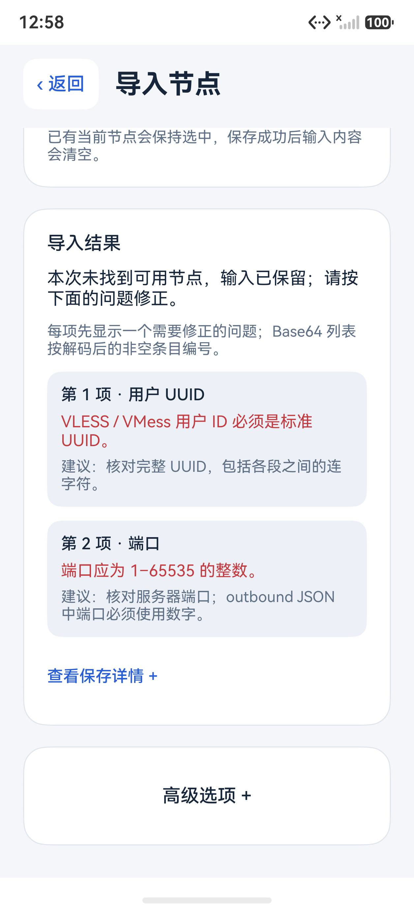
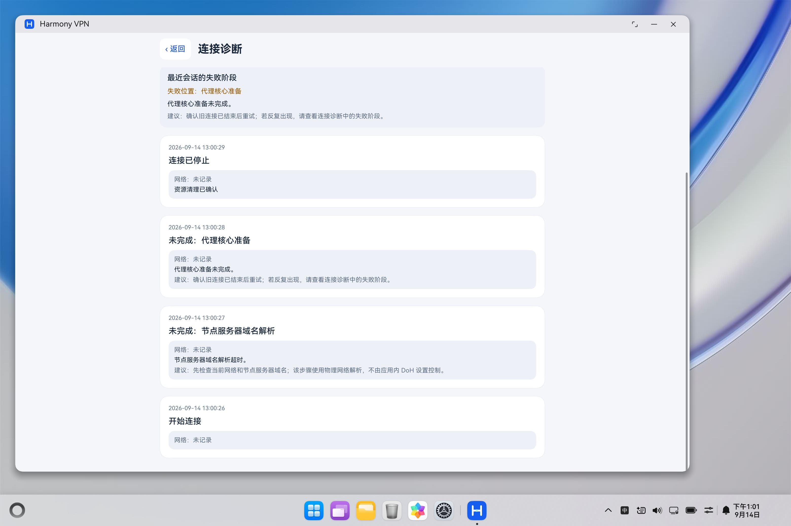
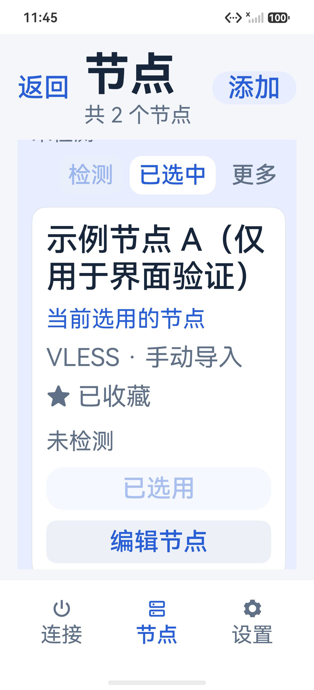
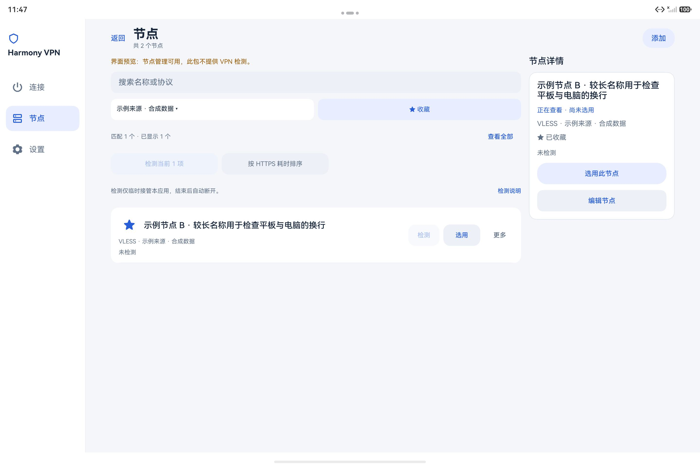

# HarmonyOS Network Connector

使用 ArkTS / ArkUI 构建的鸿蒙原生节点管理与 IPv4 代理客户端，集成 Xray 26.6.1、Hev SOCKS5 Tunnel 2.9.0 和本地适配的 Go 1.26.7 工具链。

应用显示名称为 **Harmony VPN**，当前开发版本为 **0.19.0/code40**。这是独立的开发项目，参考 v2rayNG 的功能与分享链接格式，不是 v2rayNG 或华为的官方客户端。完整 Android 功能对等和商店发布尚未完成。

0.19.0 增加本地节点配置检查，按字段显示问题与修改建议；连接失败按实际执行阶段提示，首次失败与清理问题分别保留。配置检查通过不代表节点已经联网。实现与验证状态见[阶段二十三记录](HarmonyVpnLab/docs/phase23-configuration-and-failures.md)。

0.18.0 统一异常退出后的连接状态，增加独立的服务退出观察记录，并保护重新连接与旧回调交错的边界。实现与验证状态见[阶段二十二记录](HarmonyVpnLab/docs/phase22-session-recovery.md)。

0.17.0 增加首页实时代理网速及三种节点排序，保留累计流量、时长与原有检测指标。实现与当前验证状态见[阶段二十一记录](HarmonyVpnLab/docs/phase21-rates-and-sorting.md)。

0.16.0 分别显示首次 HTTPS 与第二次请求耗时，只有系统确认复用连接时才标为“复用延迟”。旧记录保留首次值；第二次失败单独提示。此次改动用于明确测速口径，不代表转发核心性能提升。实现与验证范围见[双指标检测记录](HarmonyVpnLab/docs/phase18-latency-metrics.md)。

9 月 12 日的同版本收尾修正增加实际版本读取并同步隐私说明，当前包及重新导入后的真机复验见[收尾记录](HarmonyVpnLab/docs/phase20-restoration-and-copy.md)。它与 9 月 11 日初版的产物哈希、验证记录分开保留。

0.15.0 增加节点收藏、来源筛选和导入结果直达。宽窗口可以并排查看列表与详情，手机可展开行内详情；查看详情不会自动切换节点。收藏随节点库备份保存，兼容读取旧版节点库与备份。实现、两种调试构建和各项实际验证状态见[阶段十六记录](HarmonyVpnLab/docs/phase16-node-collection.md)。

各版本变化与验证边界见[完整变更日志](CHANGELOG.md)。本轮未修改原生转发核心；0.15 的收藏与短时连接检查属于上一版本验收，当前版本结果单独记录。

历史 0.14.0 的表单保护、列表优化与模拟器观察见[阶段十四](HarmonyVpnLab/docs/phase14-autonomous-refinement.md)，堆快照、59 分 57.29 秒观察及采集可靠性改进见[阶段十五](HarmonyVpnLab/docs/phase15-memory-observation.md)。历史结果不替代当前版本的验收。

## 当前功能

- 手机、平板与电脑窗口的响应式布局；表单最大 840 vp，窗口达到 1024 vp 使用侧导航，首页可用内容宽度达到 680 vp 使用双栏。
- 连接、节点、设置三个主入口，浅色/深色/跟随系统外观，最大 2 倍系统字号适配。
- 支持设备上的系统扫码、粘贴和批量导入，节点搜索、选择、参数/单 outbound JSON 编辑与删除。PC 缺少系统扫码能力时保留粘贴、JSON 和节点备份恢复入口。
- 节点收藏与来源筛选可和搜索、HTTPS 耗时排序组合；导入成功后可直接查看本次结果，包括已有重复项。
- 宽窗口的独立详情栏与窄窗口的行内详情；同一节点改名、收藏后，列表与详情同步刷新。
- 单节点 JSON 导出、节点与订阅备份、预览确认后恢复。
- 编辑、导入、订阅与网络设置的未保存返回确认；失败保留输入，提交后的读回异常单独提示。
- 逐节点及批量依次 HTTPS 双指标检测，可取消，支持原始顺序、首次耗时及已确认复用延迟排序，结果与配置指纹绑定。
- 全部代理或自定义域名/IPv4 分流、绕过局域网、可配置的代理内 HTTPS DNS。
- 网络变化后的恢复、等待网络时正常断开。
- 有界诊断记录与连接状态显示。
- 导入、编辑及连接前的本地配置检查；首页可手动检查当前节点，失败提示包含字段、问题和建议。
- 首页与诊断页区分 VPN 启动、节点地址解析、核心初始化、代理 DNS、HTTPS 等失败阶段，不根据原始错误文本猜测根因。

IPv6 当前进入 VPN 后被阻断，尚未提供 IPv6 代理。节点凭据保存在应用私有目录，尚未增加应用层配置加密。应用不提供节点或订阅服务；测试和实际使用需要自行配置。

**多端界面适配不等于多端 VPN 已通过。** 当前 x86_64 模拟器包仅用于界面预览，不包含 Xray/Hev 转发核心，连接、检测和开发验证均被禁用。真实平板安装与联网按用户要求暂停，尚未验收；PC 联网没有通过验收。

## 界面

下面是 **0.19.0 x86_64 界面预览包**的合成配置错误与诊断记录，均不含真实节点，也不代表模拟器 VPN 联网通过。对应流程与真机验证范围见[阶段二十三记录](HarmonyVpnLab/docs/phase23-configuration-and-failures.md)。

| 手机：按字段解释配置问题 | 电脑：按实际阶段显示失败 |
| --- | --- |
|  |  |

以下为 **0.15.0 x86_64 界面预览包**的原始截图，仅使用示例节点。预览包不含 VPN 核心，因此连接和检测按钮禁用；截图不代表联网验收。平板来源信息为合成测试数据。

| 手机：2 倍字号与行内详情 | 平板：来源、收藏与详情 |
| --- | --- |
|  |  |

上述 0.15 截图的包参数与验证记录见[阶段十六记录](HarmonyVpnLab/docs/phase16-node-collection.md)。0.16 双指标见[阶段十八记录](HarmonyVpnLab/docs/phase18-latency-metrics.md)；原始构建目录不随源码发布。

## 工程与构建

工程位于 [`HarmonyVpnLab/`](HarmonyVpnLab/)。开发环境为 **Windows + PowerShell 7 + DevEco Studio 26 / HarmonyOS SDK API 26 + Python 3.12 或更新版本 + Git**。

公开构建配置的最低系统版本为 **HarmonyOS 6.1.1（API 24）**，compile/target 仍为 **API 26**。API 24 兼容代码已为较新接口增加版本或能力判断，并补充 VPN 启动超时处理及请求代次隔离，避免迟到结果影响后续请求；这不表示真实 API 24 平板已安装或联网通过。

请从[首次构建指南](HarmonyVpnLab/docs/public-build.md)开始。核心源码、上游版本、补丁与校验信息保存在 [`native/`](HarmonyVpnLab/native/)，仓库不携带预编译 `.so`、HAP、个人证书或本机配置。

```powershell
cd HarmonyVpnLab
pwsh -File .\scripts\prepare-native.ps1
pwsh -File .\scripts\build.ps1 -NoSign
```

以上是 **ARM64 完整核心构建**，用于真实设备功能路径。只检查多端界面时，可跳过原生核心准备，另建 **x86_64 UI 预览包**：

```powershell
pwsh -File .\scripts\build.ps1 -SimulatorUI -NoSign
```

预览产物单独写入 `HarmonyVpnLab/build/artifacts/simulator-ui/`，版本带 `-ui-preview` 后缀。它不含 ARM64 核心，也不能通过修改界面开关变成 VPN 安装包。签名预览包的命令及隔离规则见[构建指南](HarmonyVpnLab/docs/public-build.md)。

首次原生构建会下载固定版本的开源依赖并编译 Go 工具链，耗时和磁盘占用明显高于日常 ArkTS 构建。脚本使用独立的 ASCII 缓存路径，以避开原生工具对中文路径的限制；源码仍可保存在中文目录。

未签名 HAP 用于检查构建是否完整，不能直接安装到真机。当前构建脚本执行 `debug` 构建；签名成功表示获得调试安装包，不表示已完成生产 Release 或商店审核。真机调试应在自己的 DevEco Studio 中配置自己的签名，不应复用其他开发者的证书或 Profile。这个仓库以源码为主，没有通用发行安装包。

## 验证范围

0.15.0 已在 API 26、ARM64 手机完成从 0.11.1 的覆盖升级，核对两条原节点、当前选择与设置保留；收藏切换及恢复后正常迁移到 v2 节点库。一次约 202 秒的 Wi-Fi 连接通过代理 DNS 与域名 HTTPS 检查，随后正常断开，确认清理完成、服务进程退出。两个调试构建各通过 13 项产物核验，最终候选通过 25 套件离线回归；三类模拟器的交互、字号和十分钟观察见[阶段十六记录](HarmonyVpnLab/docs/phase16-node-collection.md)。这些结果不代表所有协议、全天稳定性或平板/PC 联网均已验收。

已在华为 Pura 80 Ultra、HarmonyOS 7、API 26 上进行限定范围真机验证。各版本的实现、验收项目与边界分别记录，不能把历史验证视为新增功能的验收。

阶段十四当时，0.14 已通过 23/23 套件离线回归；表单、持续观察及诊断脚本分别通过 46/46、45/45、15/15 项纯模拟安全检查。以上为历史计数，阶段十五新增工具的最终计数单独记录。最终 C4 的实际 25 步 GUI 和 27 张界面截图单独留存。手机 60 分钟观察该轮未完成，阶段记录保留部分样本、历史导航失败及空闲/界面检查对照；不作无泄漏、完整长时稳定性或内存改善结论。

- [阶段十五：内存观察、对象分析与采集可靠性](HarmonyVpnLab/docs/phase15-memory-observation.md)
- [0.16.0 首次 HTTPS 与复用连接双指标](HarmonyVpnLab/docs/phase18-latency-metrics.md)
- [0.15.0 节点收藏、来源筛选与多端详情](HarmonyVpnLab/docs/phase16-node-collection.md)
- [0.14.0 表单保护、列表优化与模拟器观察](HarmonyVpnLab/docs/phase14-autonomous-refinement.md)
- [0.13.0 产品细化与验证范围](HarmonyVpnLab/docs/phase13-product-refinement.md)
- [0.12.0 多端自适应与模拟器界面验证](HarmonyVpnLab/docs/phase12-adaptive-layout-verification.md)
- [0.11.1 分流、编辑备份与批量检测](HarmonyVpnLab/docs/phase11-network-node-tools.md)
- [0.10.0 界面与回归说明](HarmonyVpnLab/docs/phase10-product-ui-verification.md)
- [0.9.0 的 30 分钟稳定性观察](HarmonyVpnLab/docs/phase9-latency-stability-verification.md)
- [支持的导入格式与限制](HarmonyVpnLab/docs/node-import-support.md)
- [开发工程说明](HarmonyVpnLab/README.md)
- [公开源码冷构建记录](HarmonyVpnLab/docs/publication-validation.json)

历史验证摘要描述特定版本与设备，不代表所有机型、协议、输入法、全天稳定性或续航已经通过。真实订阅服务与域名节点的端到端验收尚缺条件。原始本机日志、节点数据和未脱敏截图不进入公开仓库；运行脚本会在本地 `build/` 生成新的报告。

0.12.0 已完成 447 项离线检查和 ARM64 签名构建，另有手机、平板、PC 与折叠屏模拟器的界面记录。PC 已观察窗口缩放、主题及 Tab/Enter 导航；该轮未完成实际输入法、剪贴板或扫码导入验收。折叠屏内屏双栏已观察，但折叠/旋转操作曾导致宿主模拟器退出，连续切换验收尚未通过。这些模拟器记录均不能代替真实设备联网结果。

公开准备时已从不含预编译库、个人签名和旧原生缓存的副本，重新构建五个 ARM64 库并生成未签名 HAP。SDK与操作系统沿用已安装版本；该构建验证没有安装手机，也不替代上面的真机记录。

## 许可证与第三方来源

除文件另有声明外，本项目自有代码采用 **GPL-3.0-or-later**，见仓库根 [`LICENSE`](LICENSE)；第三方文件继续遵循各自原有许可，详见 [`THIRD_PARTY_NOTICES.md`](THIRD_PARTY_NOTICES.md)。实际依赖包含 MPL、GPL、LGPL（含特定链接例外）、MIT、BSD、Apache 等许可，不能把整个依赖树概括成单一宽松许可证。

公开源码不等同于完成应用商店审核。后续发行二进制时，还需提供与该产物对应的源码、补丁、许可及完整发布材料。
